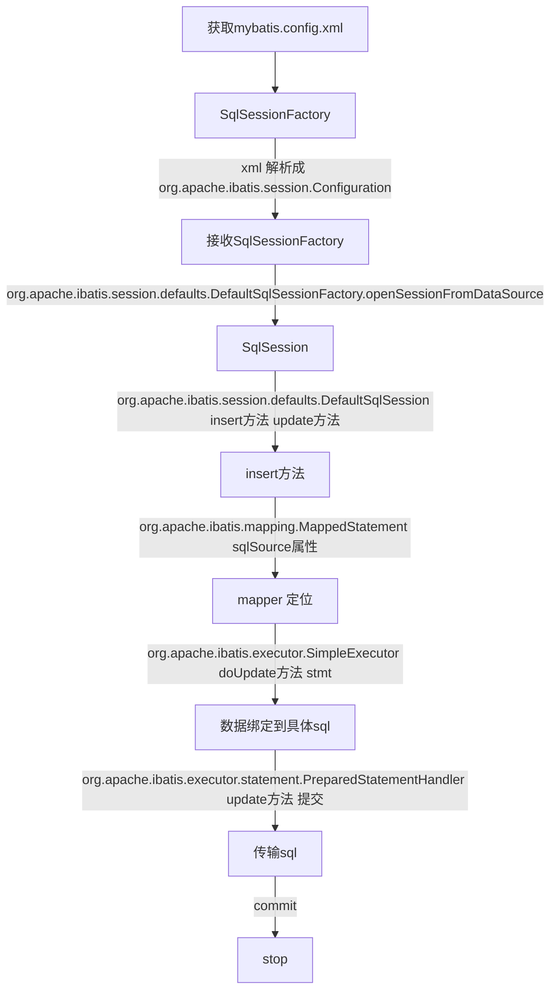

# MyBatis

## 配置

```xml
<?xml version="1.0" encoding="UTF-8"?>
<project xmlns="http://maven.apache.org/POM/4.0.0"
         xmlns:xsi="http://www.w3.org/2001/XMLSchema-instance"
         xsi:schemaLocation="http://maven.apache.org/POM/4.0.0 http://maven.apache.org/xsd/maven-4.0.0.xsd">
    <modelVersion>4.0.0</modelVersion>

    <groupId>com.huifer</groupId>
    <artifactId>mybatisBook</artifactId>
    <version>1.0-SNAPSHOT</version>


    <properties>
        <project.build.sourceEncoding>UTF-8</project.build.sourceEncoding>
        <project.reporting.outputEncoding>UTF-8</project.reporting.outputEncoding>
        <java.version>1.8</java.version>
    </properties>

    <dependencies>
        <dependency>
            <groupId>org.mybatis</groupId>
            <artifactId>mybatis</artifactId>
            <version>3.5.0</version>
        </dependency>
        <dependency>
            <groupId>mysql</groupId>
            <artifactId>mysql-connector-java</artifactId>
            <version>8.0.13</version>
        </dependency>
        <dependency>
            <groupId>org.projectlombok</groupId>
            <artifactId>lombok</artifactId>
            <version>1.18.4</version>
        </dependency>
    </dependencies>

    <build>
        <plugins>
            <plugin>
                <inherited>true</inherited>
                <groupId>org.apache.maven.plugins</groupId>
                <artifactId>maven-compiler-plugin</artifactId>
                <configuration>
                    <source>1.8</source>
                    <target>1.8</target>
                </configuration>
            </plugin>
        </plugins>
    </build>

</project>
```

mybatis-config.xml

```xml
<?xml version="1.0" encoding="UTF-8" ?>
<!DOCTYPE configuration
        PUBLIC "-//mybatis.org//DTD Config 3.0//EN"
        "http://mybatis.org/dtd/mybatis-3-config.dtd">
<configuration>
    <environments default="development">
        <environment id="development">
            <transactionManager type="JDBC"/>
            <dataSource type="POOLED">
                <property name="driver" value="com.mysql.cj.jdbc.Driver"/>
                <property name="url" value="jdbc:mysql://localhost:3306/dy_java?serverTimezone=UTC&amp;rewriteBatchedStatements=true&amp;useUnicode=true&amp;characterEncoding=utf8"/>
                <property name="username" value="root"/>
                <property name="password" value="root"/>
            </dataSource>
        </environment>
    </environments>
    <mappers>
        <mapper resource="DeptMapper.xml"/>
    </mappers>
</configuration>
```

### 测试

DeptMapper.xml

```xml
<?xml version="1.0" encoding="UTF-8" ?>
<!DOCTYPE mapper
        PUBLIC "-//mybatis.org//DTD Mapper 3.0//EN"
        "http://mybatis.org/dtd/mybatis-3-mapper.dtd">
<mapper namespace="Dept">
    <insert id="insertDept" >
        INSERT INTO dept (dname, loc)
        VALUES (#{dname} , #{loc});
  </insert>
</mapper>
```

Dept.java

```java
package com.huifer.mybatis;

import lombok.AllArgsConstructor;
import lombok.Data;
import lombok.NoArgsConstructor;

/**
 * 描述:
 *
 * @author huifer
 * @date 2019-02-21
 */
@Data
@AllArgsConstructor
@NoArgsConstructor
public class Dept {
    private Long id;
    private String dname;
    private String loc;
}
```

测试类

```java
public class Demo {

    public static void main(String[] args) throws Exception {

        Dept dept = new Dept();
        dept.setDname("技术部");
        dept.setLoc("oc");
        InputStream is = Resources.getResourceAsStream("mybatis-config.xml");
        SqlSessionFactory factory = new SqlSessionFactoryBuilder().build(is);
        SqlSession session = factory.openSession();

        session.insert("insertDept", dept);
        session.commit();

        session.close();
    }

}
```

查询表


至此初步配置完成

---

## 执行过程



### session

获取mybatils-config.xml 配置 解析xml标签

* * org.apache.ibatis.session.defaults.DefaultSqlSessionFactory

    ```java
      private SqlSession openSessionFromDataSource(ExecutorType execType, TransactionIsolationLevel level, boolean autoCommit) {
            Transaction tx = null;

            DefaultSqlSession var8;
            try {
                Environment environment = this.configuration.getEnvironment();
                TransactionFactory transactionFactory = this.getTransactionFactoryFromEnvironment(environment);
                tx = transactionFactory.newTransaction(environment.getDataSource(), level, autoCommit);
                Executor executor = this.configuration.newExecutor(tx, execType);
                var8 = new DefaultSqlSession(this.configuration, executor, autoCommit);
            } catch (Exception var12) {
                this.closeTransaction(tx);
                throw ExceptionFactory.wrapException("Error opening session.  Cause: " + var12, var12);
            } finally {
                ErrorContext.instance().reset();
            }

            return var8;
        }
    ```

    

### insert

org.apache.ibatis.session.defaults.DefaultSqlSession

```java
 public int insert(String statement, Object parameter) {
        return this.update(statement, parameter);
    }

    public int update(String statement, Object parameter) {
        int var4;
        try {
            this.dirty = true;
            MappedStatement ms = this.configuration.getMappedStatement(statement);
            var4 = this.executor.update(ms, this.wrapCollection(parameter));
        } catch (Exception var8) {
            throw ExceptionFactory.wrapException("Error updating database.  Cause: " + var8, var8);
        } finally {
            ErrorContext.instance().reset();
        }

        return var4;
    }
```

ms 对象


### doUpdate

org.apache.ibatis.executor.SimpleExecutor

```java
public int doUpdate(MappedStatement ms, Object parameter) throws SQLException {
        Statement stmt = null;

        int var6;
        try {
            Configuration configuration = ms.getConfiguration();
            StatementHandler handler = configuration.newStatementHandler(this, ms, parameter, RowBounds.DEFAULT, (ResultHandler)null, (BoundSql)null);
            stmt = this.prepareStatement(handler, ms.getStatementLog());
            var6 = handler.update(stmt);
        } finally {
            this.closeStatement(stmt);
        }

        return var6;
    }
```


### update

```
org.apache.ibatis.executor.statement.PreparedStatementHandler
```

```java
public int update(Statement statement) throws SQLException {
        PreparedStatement ps = (PreparedStatement)statement;
        ps.execute();
        int rows = ps.getUpdateCount();
        Object parameterObject = this.boundSql.getParameterObject();
        KeyGenerator keyGenerator = this.mappedStatement.getKeyGenerator();
        keyGenerator.processAfter(this.executor, this.mappedStatement, ps, parameterObject);
        return rows;
    }
```

---


