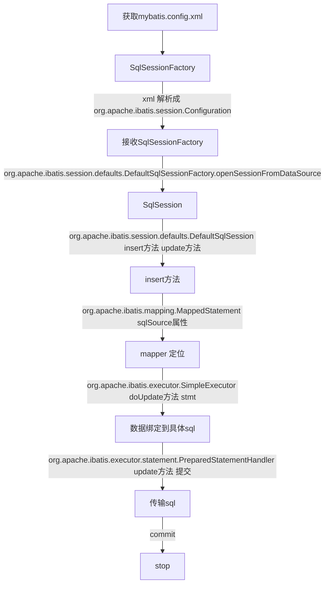
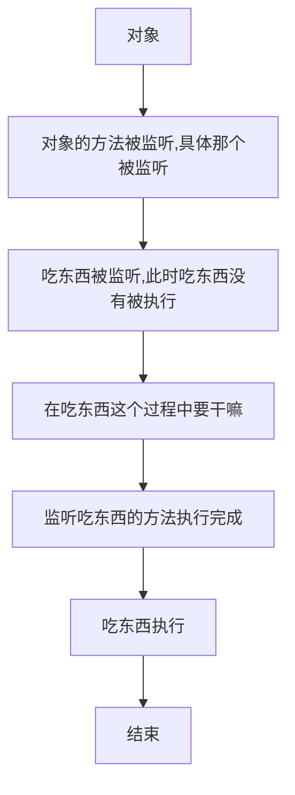

# MyBatis

## 配置

```xml
<?xml version="1.0" encoding="UTF-8"?>
<project xmlns="http://maven.apache.org/POM/4.0.0"
         xmlns:xsi="http://www.w3.org/2001/XMLSchema-instance"
         xsi:schemaLocation="http://maven.apache.org/POM/4.0.0 http://maven.apache.org/xsd/maven-4.0.0.xsd">
    <modelVersion>4.0.0</modelVersion>

    <groupId>com.huifer</groupId>
    <artifactId>mybatisBook</artifactId>
    <version>1.0-SNAPSHOT</version>


    <properties>
        <project.build.sourceEncoding>UTF-8</project.build.sourceEncoding>
        <project.reporting.outputEncoding>UTF-8</project.reporting.outputEncoding>
        <java.version>1.8</java.version>
    </properties>

    <dependencies>
        <dependency>
            <groupId>org.mybatis</groupId>
            <artifactId>mybatis</artifactId>
            <version>3.5.0</version>
        </dependency>
        <dependency>
            <groupId>mysql</groupId>
            <artifactId>mysql-connector-java</artifactId>
            <version>8.0.13</version>
        </dependency>
        <dependency>
            <groupId>org.projectlombok</groupId>
            <artifactId>lombok</artifactId>
            <version>1.18.4</version>
        </dependency>
    </dependencies>

    <build>
        <plugins>
            <plugin>
                <inherited>true</inherited>
                <groupId>org.apache.maven.plugins</groupId>
                <artifactId>maven-compiler-plugin</artifactId>
                <configuration>
                    <source>1.8</source>
                    <target>1.8</target>
                </configuration>
            </plugin>
        </plugins>
    </build>

</project>
```

mybatis-config.xml

```xml
<?xml version="1.0" encoding="UTF-8" ?>
<!DOCTYPE configuration
        PUBLIC "-//mybatis.org//DTD Config 3.0//EN"
        "http://mybatis.org/dtd/mybatis-3-config.dtd">
<configuration>
    <environments default="development">
        <environment id="development">
            <transactionManager type="JDBC"/>
            <dataSource type="POOLED">
                <property name="driver" value="com.mysql.cj.jdbc.Driver"/>
                <property name="url" value="jdbc:mysql://localhost:3306/dy_java?serverTimezone=UTC&amp;rewriteBatchedStatements=true&amp;useUnicode=true&amp;characterEncoding=utf8"/>
                <property name="username" value="root"/>
                <property name="password" value="root"/>
            </dataSource>
        </environment>
    </environments>
    <mappers>
        <mapper resource="DeptMapper.xml"/>
    </mappers>
</configuration>
```

### 测试

DeptMapper.xml

```xml
<?xml version="1.0" encoding="UTF-8" ?>
<!DOCTYPE mapper
        PUBLIC "-//mybatis.org//DTD Mapper 3.0//EN"
        "http://mybatis.org/dtd/mybatis-3-mapper.dtd">
<mapper namespace="Dept">
    <insert id="insertDept" >
        INSERT INTO dept (dname, loc)
        VALUES (#{dname} , #{loc});
  </insert>
</mapper>
```

Dept.java

```java
package com.huifer.mybatis;

import lombok.AllArgsConstructor;
import lombok.Data;
import lombok.NoArgsConstructor;

/**
 * 描述:
 *
 * @author huifer
 * @date 2019-02-21
 */
@Data
@AllArgsConstructor
@NoArgsConstructor
public class Dept {
    private Long id;
    private String dname;
    private String loc;
}
```

测试类

```java
public class Demo {

    public static void main(String[] args) throws Exception {

        Dept dept = new Dept();
        dept.setDname("技术部");
        dept.setLoc("oc");
        InputStream is = Resources.getResourceAsStream("mybatis-config.xml");
        SqlSessionFactory factory = new SqlSessionFactoryBuilder().build(is);
        SqlSession session = factory.openSession();

        session.insert("insertDept", dept);
        session.commit();

        session.close();
    }

}
```

查询表


至此初步配置完成

---

## 执行过程



### session

获取mybatils-config.xml 配置 解析xml标签

* * org.apache.ibatis.session.defaults.DefaultSqlSessionFactory

    ```java
      private SqlSession openSessionFromDataSource(ExecutorType execType, TransactionIsolationLevel level, boolean autoCommit) {
            Transaction tx = null;

            DefaultSqlSession var8;
            try {
                Environment environment = this.configuration.getEnvironment();
                TransactionFactory transactionFactory = this.getTransactionFactoryFromEnvironment(environment);
                tx = transactionFactory.newTransaction(environment.getDataSource(), level, autoCommit);
                Executor executor = this.configuration.newExecutor(tx, execType);
                var8 = new DefaultSqlSession(this.configuration, executor, autoCommit);
            } catch (Exception var12) {
                this.closeTransaction(tx);
                throw ExceptionFactory.wrapException("Error opening session.  Cause: " + var12, var12);
            } finally {
                ErrorContext.instance().reset();
            }

            return var8;
        }
    ```

    

### insert

org.apache.ibatis.session.defaults.DefaultSqlSession

```java
 public int insert(String statement, Object parameter) {
        return this.update(statement, parameter);
    }

    public int update(String statement, Object parameter) {
        int var4;
        try {
            this.dirty = true;
            MappedStatement ms = this.configuration.getMappedStatement(statement);
            var4 = this.executor.update(ms, this.wrapCollection(parameter));
        } catch (Exception var8) {
            throw ExceptionFactory.wrapException("Error updating database.  Cause: " + var8, var8);
        } finally {
            ErrorContext.instance().reset();
        }

        return var4;
    }
```

ms 对象


### doUpdate

org.apache.ibatis.executor.SimpleExecutor

```java
public int doUpdate(MappedStatement ms, Object parameter) throws SQLException {
        Statement stmt = null;

        int var6;
        try {
            Configuration configuration = ms.getConfiguration();
            StatementHandler handler = configuration.newStatementHandler(this, ms, parameter, RowBounds.DEFAULT, (ResultHandler)null, (BoundSql)null);
            stmt = this.prepareStatement(handler, ms.getStatementLog());
            var6 = handler.update(stmt);
        } finally {
            this.closeStatement(stmt);
        }

        return var6;
    }
```


### update

```
org.apache.ibatis.executor.statement.PreparedStatementHandler
```

```java
public int update(Statement statement) throws SQLException {
        PreparedStatement ps = (PreparedStatement)statement;
        ps.execute();
        int rows = ps.getUpdateCount();
        Object parameterObject = this.boundSql.getParameterObject();
        KeyGenerator keyGenerator = this.mappedStatement.getKeyGenerator();
        keyGenerator.processAfter(this.executor, this.mappedStatement, ps, parameterObject);
        return rows;
    }
```

---


---

## Mapper

```xml
  <mappers>
        <!--<mapper resource="DeptMapper.xml"/>-->
        <package name="com.huifer.mybatis.dao"/>
    </mappers>
```


### 获取过程源码

- org.apache.ibatis.builder.xml.XMLConfigBuilder 使用parseConfiguration 方法将 mybatis-config.xml 中的mappers 标签内容获取到 mapperElement具体执行获取内容 ，作用将mappers添加到configuration 中

  ```java
  private void parseConfiguration(XNode root) {
          try {
              this.propertiesElement(root.evalNode("properties"));
              Properties settings = this.settingsAsProperties(root.evalNode("settings"));
              this.loadCustomVfs(settings);
              this.loadCustomLogImpl(settings);
              this.typeAliasesElement(root.evalNode("typeAliases"));
              this.pluginElement(root.evalNode("plugins"));
              this.objectFactoryElement(root.evalNode("objectFactory"));
              this.objectWrapperFactoryElement(root.evalNode("objectWrapperFactory"));
              this.reflectorFactoryElement(root.evalNode("reflectorFactory"));
              this.settingsElement(settings);
              this.environmentsElement(root.evalNode("environments"));
              this.databaseIdProviderElement(root.evalNode("databaseIdProvider"));
              this.typeHandlerElement(root.evalNode("typeHandlers"));
              this.mapperElement(root.evalNode("mappers"));
          } catch (Exception var3) {
              throw new BuilderException("Error parsing SQL Mapper Configuration. Cause: " + var3, var3);
          }
      }
  
  
  private void mapperElement(XNode parent) throws Exception {
          if (parent != null) {
              Iterator var2 = parent.getChildren().iterator();
  
              while(true) {
                  while(var2.hasNext()) {
                      XNode child = (XNode)var2.next();
                      String resource;
                      if ("package".equals(child.getName())) {
                          resource = child.getStringAttribute("name");
                          this.configuration.addMappers(resource);
                      } else {
                          resource = child.getStringAttribute("resource");
                          String url = child.getStringAttribute("url");
                          String mapperClass = child.getStringAttribute("class");
                          XMLMapperBuilder mapperParser;
                          InputStream inputStream;
                          if (resource != null && url == null && mapperClass == null) {
                              ErrorContext.instance().resource(resource);
                              inputStream = Resources.getResourceAsStream(resource);
                              mapperParser = new XMLMapperBuilder(inputStream, this.configuration, resource, this.configuration.getSqlFragments());
                              mapperParser.parse();
                          } else if (resource == null && url != null && mapperClass == null) {
                              ErrorContext.instance().resource(url);
                              inputStream = Resources.getUrlAsStream(url);
                              mapperParser = new XMLMapperBuilder(inputStream, this.configuration, url, this.configuration.getSqlFragments());
                              mapperParser.parse();
                          } else {
                              if (resource != null || url != null || mapperClass == null) {
                                  throw new BuilderException("A mapper element may only specify a url, resource or class, but not more than one.");
                              }
  
                              Class<?> mapperInterface = Resources.classForName(mapperClass);
                              this.configuration.addMapper(mapperInterface);
                          }
                      }
                  }
  
                  return;
              }
          }
      }
  ```

  

  当前Configuration 下的mappedStatements 属性

  

- org.apache.ibatis.binding.MapperRegistry     addMapper 方法，作用将解析到的接口对象放到configuration 中 ，一个接口只能注册一次

  ```java
  
      public <T> void addMapper(Class<T> type) {
          if (type.isInterface()) {
              if (this.hasMapper(type)) {
                  throw new BindingException("Type " + type + " is already known to the MapperRegistry.");
              }
  
              boolean loadCompleted = false;
  
              try {
                  this.knownMappers.put(type, new MapperProxyFactory(type));
                  MapperAnnotationBuilder parser = new MapperAnnotationBuilder(this.config, type);
                  parser.parse();
                  loadCompleted = true;
              } finally {
                  if (!loadCompleted) {
                      this.knownMappers.remove(type);
                  }
  
              }
          }
  
      }
  ```

- org.apache.ibatis.builder.annotation.MapperAnnotationBuilder    parse方法

  loadXmlResource 来确认加载具体的xml文件

  

  ```java
  public void parse() {
          String resource = this.type.toString();
          if (!this.configuration.isResourceLoaded(resource)) {
              this.loadXmlResource();
              this.configuration.addLoadedResource(resource);
              this.assistant.setCurrentNamespace(this.type.getName());
              this.parseCache();
              this.parseCacheRef();
              Method[] methods = this.type.getMethods();
              Method[] var3 = methods;
              int var4 = methods.length;
  
              for(int var5 = 0; var5 < var4; ++var5) {
                  Method method = var3[var5];
  
                  try {
                      if (!method.isBridge()) {
                          this.parseStatement(method);
                      }
                  } catch (IncompleteElementException var8) {
                      this.configuration.addIncompleteMethod(new MethodResolver(this, method));
                  }
              }
          }
  
          this.parsePendingMethods();
      }
  
  
      private void loadXmlResource() {
          if (!this.configuration.isResourceLoaded("namespace:" + this.type.getName())) {
              String xmlResource = this.type.getName().replace('.', '/') + ".xml";
              InputStream inputStream = this.type.getResourceAsStream("/" + xmlResource);
              if (inputStream == null) {
                  try {
                      inputStream = Resources.getResourceAsStream(this.type.getClassLoader(), xmlResource);
                  } catch (IOException var4) {
                  }
              }
  
              if (inputStream != null) {
                  XMLMapperBuilder xmlParser = new XMLMapperBuilder(inputStream, this.assistant.getConfiguration(), xmlResource, this.configuration.getSqlFragments(), this.type.getName());
                  xmlParser.parse();
              }
          }
  
      }
  
  ```
  **根据 loadXmlResource 中下面这行得知 ， PojoMapper.xml 要和 PojoMapperInterface 放在一个路径下**

  ```
  String xmlResource = this.type.getName().replace('.', '/') + ".xml";
  ```

  

  

### 具体sql

- org.apache.ibatis.builder.xml.XMLStatementBuilder    parseStatementNode 方法解析sql语句

  ```xml
    <select id="deptFindById" resultType="com.huifer.mybatis.pojo.Dept" parameterType="java.lang.Long">
          select * from dept where dept.id=#{deptno};
      </select>
  
  ```

  ```java
  public void parseStatementNode() {
          String id = this.context.getStringAttribute("id");
          String databaseId = this.context.getStringAttribute("databaseId");
          if (this.databaseIdMatchesCurrent(id, databaseId, this.requiredDatabaseId)) {
              Integer fetchSize = this.context.getIntAttribute("fetchSize");
              Integer timeout = this.context.getIntAttribute("timeout");
              String parameterMap = this.context.getStringAttribute("parameterMap");
              String parameterType = this.context.getStringAttribute("parameterType");
              Class<?> parameterTypeClass = this.resolveClass(parameterType);
              String resultMap = this.context.getStringAttribute("resultMap");
              String resultType = this.context.getStringAttribute("resultType");
              String lang = this.context.getStringAttribute("lang");
              LanguageDriver langDriver = this.getLanguageDriver(lang);
              Class<?> resultTypeClass = this.resolveClass(resultType);
              String resultSetType = this.context.getStringAttribute("resultSetType");
              StatementType statementType = StatementType.valueOf(this.context.getStringAttribute("statementType", StatementType.PREPARED.toString()));
              ResultSetType resultSetTypeEnum = this.resolveResultSetType(resultSetType);
              String nodeName = this.context.getNode().getNodeName();
              SqlCommandType sqlCommandType = SqlCommandType.valueOf(nodeName.toUpperCase(Locale.ENGLISH));
              boolean isSelect = sqlCommandType == SqlCommandType.SELECT;
              boolean flushCache = this.context.getBooleanAttribute("flushCache", !isSelect);
              boolean useCache = this.context.getBooleanAttribute("useCache", isSelect);
              boolean resultOrdered = this.context.getBooleanAttribute("resultOrdered", false);
              XMLIncludeTransformer includeParser = new XMLIncludeTransformer(this.configuration, this.builderAssistant);
              includeParser.applyIncludes(this.context.getNode());
              this.processSelectKeyNodes(id, parameterTypeClass, langDriver);
              SqlSource sqlSource = langDriver.createSqlSource(this.configuration, this.context, parameterTypeClass);
              String resultSets = this.context.getStringAttribute("resultSets");
              String keyProperty = this.context.getStringAttribute("keyProperty");
              String keyColumn = this.context.getStringAttribute("keyColumn");
              String keyStatementId = id + "!selectKey";
              keyStatementId = this.builderAssistant.applyCurrentNamespace(keyStatementId, true);
              Object keyGenerator;
              if (this.configuration.hasKeyGenerator(keyStatementId)) {
                  keyGenerator = this.configuration.getKeyGenerator(keyStatementId);
              } else {
                  keyGenerator = this.context.getBooleanAttribute("useGeneratedKeys", this.configuration.isUseGeneratedKeys() && SqlCommandType.INSERT.equals(sqlCommandType)) ? Jdbc3KeyGenerator.INSTANCE : NoKeyGenerator.INSTANCE;
              }
  
              this.builderAssistant.addMappedStatement(id, sqlSource, statementType, sqlCommandType, fetchSize, timeout, parameterMap, parameterTypeClass, resultMap, resultTypeClass, resultSetTypeEnum, flushCache, useCache, resultOrdered, (KeyGenerator)keyGenerator, keyProperty, keyColumn, databaseId, langDriver, resultSets);
          }
      }
  ```

  

- 还原sql方法

  ```
  SqlSource sqlSource = langDriver.createSqlSource(this.configuration, this.context, parameterTypeClass);
  ```

- org.apache.ibatis.scripting.defaults.RawSqlSource  RawSqlSource方法

  ```java
  public RawSqlSource(Configuration configuration, String sql, Class<?> parameterType) {
          SqlSourceBuilder sqlSourceParser = new SqlSourceBuilder(configuration);
          Class<?> clazz = parameterType == null ? Object.class : parameterType;
          this.sqlSource = sqlSourceParser.parse(sql, clazz, new HashMap());
      }
  ```

- org.apache.ibatis.builder.SqlSourceBuilder  parse方法还原成sql语句

  ```java
      public SqlSource parse(String originalSql, Class<?> parameterType, Map<String, Object> additionalParameters) {
          SqlSourceBuilder.ParameterMappingTokenHandler handler = new SqlSourceBuilder.ParameterMappingTokenHandler(this.configuration, parameterType, additionalParameters);
          GenericTokenParser parser = new GenericTokenParser("#{", "}", handler);
          String sql = parser.parse(originalSql);
          return new StaticSqlSource(this.configuration, sql, handler.getParameterMappings());
      }
  ```

  

- 最后看一下 sqlSource

  

---

## 代理模式

java 代理模式实现

1. 先实现一个主要业务

   ```java
   package com.huifer.mybatis.proxy;
   
   /**
    * 描述:
    * 默认监听方法设计
    *
    * @author huifer
    * @date 2019-02-24
    */
   public interface BaseMothed {
       /**
        * 吃
        */
       void eat();
   
       /**
        * 玩
        */
       void play();
   }
   
   ```

   

2. 对主要业务进行实现

   ```java
   package com.huifer.mybatis.proxy;
   
   /**
    * 描述:
    *	主要业务的实现
    * @author huifer
    * @date 2019-02-24
    */
   public class Person implements BaseMothed {
       @Override
       public void eat() {
           System.out.println("吃东西了");
       }
   
       @Override
       public void play() {
           System.out.println("开始玩了");
       }
   }
   
   ```

   

3. 创建一个监听业务的工具

   ```java
   package com.huifer.mybatis.proxy;
   
   import java.lang.reflect.InvocationHandler;
   import java.lang.reflect.Method;
   
   /**
    * 描述:
    * 通知类
    *
    * @author huifer
    * @date 2019-02-24
    */
   public class InformUtil implements InvocationHandler {
   
       /**
        * 被监控的对象，不能是具体实现类，要多具体行为进行监控
        */
       private BaseMothed obj;
   
   
       public InformUtil(BaseMothed mothed) {
           this.obj = mothed;
       }
   
   
       /***
        * 被监控行为执行时，拦截
        * @param proxy 代理对象
        * @param method 监控方法 主要业务
        * @param args method的参数
        * @return
        * @throws Throwable
        */
       @Override
       public Object invoke(Object proxy, Method method, Object[] args) throws Throwable {
           // 获取返回结果
           Object result;
   
           // 判断行为
           String methodName = method.getName();
           if ("eat".equals(methodName)) {
               cc();
               result = method.invoke(this.obj, args);
           } else {
               cc();
               result = method.invoke(this.obj, args);
           }
   
           return result;
       }
   
       /***
        * 次要业务实现
        */
       public void cc() {
           System.out.println("监听一下下操作内容");
       }
   
   
   }
   
   ```

   

4. 实现代理对象

   ```java
   package com.huifer.mybatis.proxy;
   
   import java.lang.reflect.InvocationHandler;
   import java.lang.reflect.Proxy;
   
   /**
    * 描述:
    * 代理工厂
    *
    * @author huifer
    * @date 2019-02-24
    */
   public class ProxyFactory {
       /**
        * 代理对象的数据类型由监听行为描述
        *
        * @return {@link BaseMothed}
        */
       public static BaseMothed builder(Class classFile) throws IllegalAccessException, InstantiationException {
           // 监听对象创建
           BaseMothed baseMothed = (BaseMothed) classFile.newInstance();
           // 通知对象
           InvocationHandler invocationHandler = new InformUtil(baseMothed);
           // 代理对象创建
           BaseMothed proxyObj = (BaseMothed) Proxy.newProxyInstance(baseMothed.getClass().getClassLoader(), baseMothed.getClass().getInterfaces(), invocationHandler);
           return proxyObj;
       }
   }
   
   ```

5. 测试

   ```java
   package com.huifer.mybatis.proxy;
   
   /**
    * 描述:
    *
    * @author huifer
    * @date 2019-02-24
    */
   public class Main {
       public static void main(String[] args) throws Exception{
   
           // 代理对象创建
           BaseMothed wang = ProxyFactory.builder(Person.class);
           wang.eat();
   
       }
   }
   
   ```




---

## 代理模式下JDBC

- SqlSession

  ```java
  package com.huifer.mybatis.jdbcProxy;
  
  import java.sql.SQLException;
  
  /**
   * 描述:
   *
   * @author huifer
   * @date 2019-02-24
   */
  public interface SqlSession {
      public Object select(String sql) throws SQLException;
  }
  
  ```

  

- SqlInvaction

  ```java
  package com.huifer.mybatis.jdbcProxy;
  
  import java.lang.reflect.Field;
  import java.lang.reflect.InvocationHandler;
  import java.lang.reflect.Method;
  import java.sql.Connection;
  import java.sql.DriverManager;
  import java.sql.PreparedStatement;
  import java.sql.ResultSet;
  
  /**
   * 描述:
   *
   * @author huifer
   * @date 2019-02-24
   */
  public class SqlInvaction implements InvocationHandler {
  
      private SqlSession obj;
      Connection connection;
      PreparedStatement preparedStatement;
  
      public SqlInvaction(SqlSession obj) {
          this.obj = obj;
      }
  
      @Override
      public ResultSet invoke(Object proxy, Method method, Object[] args) throws Throwable {
          init();
          Field ps = obj.getClass().getDeclaredField("preparedStatement");
          ps.set(obj, preparedStatement);
          ResultSet rs = (ResultSet) method.invoke(obj, args);
  
          while (rs.next()) {
              int id = rs.getInt("id");
              String dname = rs.getString("dname");
              String loc = rs.getString("loc");
  
              System.out.println(id + "\t" + dname + "\t" + loc);
          }
  
          end();
  
          return rs;
      }
  
  
      private void init() throws Exception {
          Class.forName("com.mysql.cj.jdbc.Driver");
          this.connection = DriverManager.getConnection("jdbc:mysql://localhost:3306/dy_java?serverTimezone=UTC&rewriteBatchedStatements=true&useUnicode=true&characterEncoding=utf8", "root", "root");
          this.preparedStatement = connection.prepareStatement(" ");
      }
  
      private void end() throws Exception {
          if (this.preparedStatement != null) {
              this.preparedStatement.close();
          }
          if (this.connection != null) {
              this.connection.close();
          }
      }
  
  }
  
  ```

  

- SqlSessionFaction

  ```java
  package com.huifer.mybatis.jdbcProxy;
  
  import java.lang.reflect.InvocationHandler;
  import java.lang.reflect.Proxy;
  
  /**
   * 描述:
   *
   * @author huifer
   * @date 2019-02-24
   */
  public class SqlSessionFaction {
      public static SqlSession builder(Class classFile) throws Exception {
          SqlSession sqlSession = (SqlSession) classFile.newInstance();
          InvocationHandler invocationHandler = new SqlInvaction(sqlSession);
          SqlSession proxy = (SqlSession) Proxy.newProxyInstance(sqlSession.getClass().getClassLoader(), sqlSession.getClass().getInterfaces(), invocationHandler);
          return proxy;
      }
  }
  
  ```

  

- DeptMapper

  ```java
  package com.huifer.mybatis.jdbcProxy;
  
  import java.sql.PreparedStatement;
  import java.sql.ResultSet;
  import java.sql.SQLException;
  
  /**
   * 描述:
   *
   * @author huifer
   * @date 2019-02-24
   */
  public class DeptMapper implements SqlSession {
      PreparedStatement preparedStatement;
      @Override
      public Object select(String sql) throws SQLException {
          ResultSet resultSet = preparedStatement.executeQuery(sql);
          return resultSet;
      }
  }
  
  ```

  

- Main

  ```java
  package com.huifer.mybatis.jdbcProxy;
  
  /**
   * 描述:
   *
   * @author huifer
   * @date 2019-02-24
   */
  public class Main {
      public static void main(String[] args) throws Exception {
  
          SqlSession builder = SqlSessionFaction.builder(DeptMapper.class);
          Object obj = builder.select("select * from dept");
  
  
  
          System.out.println();
      }
  }
  
  ```

  

  

