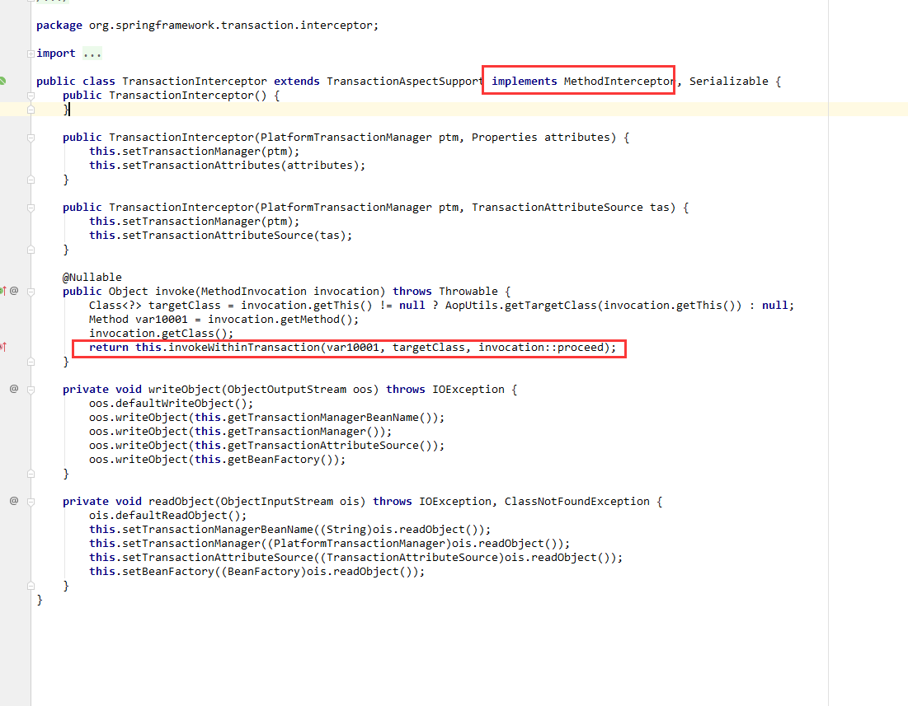

# Spring

## Ioc

### 依赖

```xml
<dependency>
    <groupId>org.springframework</groupId>
    <artifactId>spring-core</artifactId>
    <version>5.1.5.RELEASE</version>
</dependency>
<dependency>
    <groupId>org.springframework</groupId>
    <artifactId>spring-beans</artifactId>
    <version>5.1.5.RELEASE</version>
</dependency>
```

#### 简单操作

- 定义学生类 student 和 老师类 teacher 并且交给spring 管理

```JAVA
@Data
public class Student {

    private String sname;
    private int age;
    private Teacher teacher;
}

```

```java
@Data
public class Teacher {
    private String tname;

}

```

- spring-config.xml

  ```xml
  <?xml version="1.0" encoding="UTF-8"?>
  <beans xmlns="http://www.springframework.org/schema/beans"
         xmlns:xsi="http://www.w3.org/2001/XMLSchema-instance"
         xmlns:p="http://www.springframework.org/schema/p"
         xmlns:c="http://www.springframework.org/schema/c"
         xsi:schemaLocation=" http://www.springframework.org/schema/beans
          http://www.springframework.org/schema/beans/spring-beans.xsd
          http://www.springframework.org/schema/context
          http://www.springframework.org/schema/context/spring-context.xsd">
  
  
      <bean id="teacher" class="com.huifer.bean.Teacher">
          <property name="tname" value="Mr.huifer"/>
      </bean>
  
      <bean id="student" class="com.huifer.bean.Student">
          <property name="age" value="21"/>
          <property name="sname" value="wang"/>
          <property name="teacher" ref="teacher"/>
      </bean>
  </beans>
  ```

- 每一个bean标签都是一个键值对形式表述 ， 在Ioc容器中。利用id属性获取

- 测试类

  ```java
  public class SpringIoc {
  
      @Test
      public void testIocDemo01(){
          ClassPathXmlApplicationContext context = new ClassPathXmlApplicationContext("spring_config.xml");
  
          Student stu = (Student) context.getBean("student");
          Teacher tea = (Teacher) context.getBean("teacher");
  
          System.out.println();
      }
  
  }
  ```

  可以看到在Spring-config.xml 中定义的beans 在BeanDefinition中存放 是一个map对象

](/ch-2/assets/1551500140955.png)

---

#### 模拟一个beans获取

- beans标签的储存

  ```java
  
  /**
   * 描述:
   * beans 标签的存储
   *
   * @author huifer
   * @date 2019-03-02
   */
  @Data
  public class BeanDefined {
      /**
       * bean id
       */
      private String  beanId;
      /**
       * bean对应的全路径
       */
      private String classPath;
  }
  
  ```

  

- BeanFactory bean工厂

  - 方法getBeans(String beanId) 用来获取bean

  ```java
  /**
   * 描述:
   * bean 工厂
   *
   * @author huifer
   * @date 2019-03-02
   */
  @Data
  public class BeanFactory {
      /**
       * beans标签列表
       */
      private List<BeanDefined> beanDefineds;
  
      /**
       * 模仿 Spring 中的getBeans
       *
       * @param beanId beans 标签的id
       * @return object 类
       */
      public   Object getBean(String beanId) {
          Object obj = null;
          // 从bean标签集合中获取id一样的
          for (BeanDefined beanDefined : beanDefineds) {
              if (beanDefined.getBeanId().equals(beanId)) {
                  // 构造出正确的类
                  String classPath = beanDefined.getClassPath();
                  try {
                      Class classFile = Class.forName(classPath);
                      obj = classFile.newInstance();
                      return obj;
                  } catch (ClassNotFoundException e) {
                      System.err.println("当前类文件不存在");
                      e.printStackTrace();
                  } catch (Exception e) {
                      e.printStackTrace();
                  }
              }
          }
          return obj;
  
      }
  
  }
  
  ```

- 测试用例

  ```java
  public class BeanFactoryTest {
  
  
      @Test
      public void beanTest() {
          // 1.声明 bean
          BeanDefined beanDefined = new BeanDefined();
          beanDefined.setBeanId("teacher");
          beanDefined.setClassPath("com.huifer.bean.Teacher");
          // 2.将bean放到工厂中
          List<BeanDefined> beanDefinedList = new ArrayList<BeanDefined>();
          beanDefinedList.add(beanDefined);
          BeanFactory beanFactory = new BeanFactory();
          beanFactory.setBeanDefineds(beanDefinedList);
          // 3.从工厂中获取具体实例
  
          Teacher teacher = (Teacher) beanFactory.getBean("teacher");
  
          System.out.println();
      }
  
  }
  ```

---

### spring scope  

- singleton 
  -  单例模式， spring容器启动就创建，每次都是同一个实例对象
- prototype : 
  - 在调用getBeans 创建， 每次都是全新实例

#### 修改 beansFactory

- BeanFactory

  -  getBeanScope

  ```java
  package com.huifer.util;
  
  import lombok.Data;
  import lombok.NoArgsConstructor;
  
  import java.util.HashMap;
  import java.util.List;
  import java.util.Map;
  
  /**
   * 描述:
   * bean 工厂
   *
   * @author huifer
   * @date 2019-03-02
   */
  @Data
  @NoArgsConstructor
  public class BeanFactory {
      /**
       * beans标签列表
       */
      private List<BeanDefined> beanDefineds;
  
      /**
       * 模仿 Spring 中的getBeans
       *
       * @param beanId beans 标签的id
       * @return object 类
       */
      public Object getBean(String beanId) {
          Object obj = null;
          // 从bean标签集合中获取id一样的
          for (BeanDefined beanDefined : beanDefineds) {
              if (beanDefined.getBeanId().equals(beanId)) {
                  // 构造出正确的类
                  String classPath = beanDefined.getClassPath();
                  try {
                      Class classFile = Class.forName(classPath);
                      obj = classFile.newInstance();
                      return obj;
                  } catch (ClassNotFoundException e) {
                      System.err.println("当前类文件不存在");
                      e.printStackTrace();
                  } catch (Exception e) {
                      e.printStackTrace();
                  }
              }
          }
          return obj;
  
      }
  
      /**
       * id-> 具体对象
       */
      private Map<String, Object> springSingleton;
  
      public BeanFactory(List<BeanDefined> beanDefineds) throws Exception {
          this.beanDefineds = beanDefineds;
  
          springSingleton = new HashMap<>();
          for (BeanDefined beans : beanDefineds) {
              if (beans.getScope().equals("singleton")) {
                  Object o = Class.forName(beans.getClassPath()).newInstance();
                  springSingleton.put(beans.getBeanId(), Class.forName(beans.getClassPath()).newInstance());
              }
          }
  
      }
  
      public Object getBeanScope(String beanId) throws Exception {
          Object obj = null;
          for (BeanDefined beanDefined : beanDefineds) {
              if (beanDefined.getBeanId().equals(beanId)) {
                  String classPath = beanDefined.getClassPath();
                  Class<?> classFile = Class.forName(classPath);
                  String scope = beanDefined.getScope();
                  if (scope.equals("prototype")) {
                      // 每次做一个新的对象返回
                      obj = classFile.newInstance();
                  } else {
                      // 每次返回同一个对象
                      springSingleton.get(beanDefined.getBeanId());
                  }
                  return obj;
  
              }
          }
          return obj;
      }
  
  
  }
  
  ```

- 测试用例

  ```java
      @Test
      public void beanTest02() throws Exception {
          // 1.声明 bean
          BeanDefined bean01 = new BeanDefined();
          bean01.setBeanId("teacher");
          bean01.setClassPath("com.huifer.bean.Teacher");
          bean01.setScope("prototype");
  
  
          BeanDefined bean02 = new BeanDefined();
          bean02.setBeanId("student");
          bean02.setClassPath("com.huifer.bean.Student");
  
  
          // 2.将bean放到工厂中
          List<BeanDefined> beanDefinedList = new ArrayList<BeanDefined>();
          beanDefinedList.add(bean01);
          beanDefinedList.add(bean02);
          BeanFactory beanFactory = new BeanFactory(beanDefinedList);
          // 3.从工厂中获取具体实例
  
          Teacher teacher1 = (Teacher) beanFactory.getBean("teacher");
          Teacher teacher2 = (Teacher) beanFactory.getBean("teacher");
  
          System.out.println(teacher1 == teacher2);
          Assert.assertFalse(teacher1==teacher2);
          Student stu = (Student) beanFactory.getBeanScope("student");
          Student st2 = (Student) beanFactory.getBeanScope("student");
          System.out.println(stu == st2);
          Assert.assertTrue(stu == st2);
  
          System.out.println();
      }
  
  ```

---

### 动态工厂

- 老师的自定义工厂

  ```java
  /**
   * 描述:
   * 老师工厂
   *
   * @author huifer
   * @date 2019-03-02
   */
  public class TeacherFactory {
      /**
       * 简单工厂
       *
       * @return
       */
      public Teacher createTeacher() {
          System.out.println("自定义老师工厂 简单工厂");
          return new Teacher();
      }
  }
  
  ```

- 添加配置

  ```xml
     <!--自定义工厂 ， 动态工厂-->
      <bean id="tFactory" class="com.huifer.util.TeacherFactory"></bean>
      <bean id="teacher1" factory-bean="tFactory" factory-method="createTeacher"></bean>
  
  ```

  

- 测试类

  ```java
  
      @Test
      public void testIocDemo02() {
          Teacher tea = (Teacher) context.getBean("teacher1");
  
      }
  ```

  

控制台输出
  自定义老师工厂 简单工厂

- 后期修改实例创建方式直接修改工厂类即可


#### 修改 beansFactory

```java
public Object getBeanFactory(String beanId) throws Exception {
        Object obj = null;
        for (BeanDefined beanDefined : beanDefineds) {

            if (beanDefined.getBeanId().equals(beanId)) {
                String classPath = beanDefined.getClassPath();
                Class<?> classFile = Class.forName(classPath);
                String scope = beanDefined.getScope();
                String factoryBean = beanDefined.getFactoryBean();
                String factoryMethod = beanDefined.getFactoryMethod();
                if (scope.equals("prototype")) {
                    // 每次做一个新的对象返回

                    if (factoryBean != null && factoryMethod != null) {
                        // 自己根据 factoryBean +  factoryMethod创建一个实例对象

                        Object oc = classFile.newInstance();
                        Method method = classFile.getDeclaredMethod(factoryMethod, null);
                        method.setAccessible(true);
                        obj = method.invoke(oc, null);
                    } else {
                        obj = classFile.newInstance();
                    }
                } else {
                    // 每次返回同一个对象
                    Ioc.get(beanDefined.getBeanId());
                }
                return obj;

            }
        }

        return obj;
    }
```

- 测试用例

  ```java
  @Test
      public void beanTest03() throws Exception {
          BeanDefined bean01 = new BeanDefined();
          bean01.setBeanId("teacher");
          bean01.setClassPath("com.huifer.bean.TeacherFactory");
          bean01.setFactoryBean("tFactory");
          bean01.setFactoryMethod("createTeacher");
          bean01.setScope("prototype");
  
  
  
          List<BeanDefined> beanDefinedList = new ArrayList<BeanDefined>();
          beanDefinedList.add(bean01);
  
          BeanFactory beanFactory = new BeanFactory(beanDefinedList);
  
  
          Teacher teacher1 = (Teacher) beanFactory.getBeanFactory("teacher");
          System.out.println(teacher1);
  
      }
  
  ```

- 控制台输出

  ```
  自定义老师工厂 简单工厂
  Teacher(tname=null)
  ```

  

---

### 静态工厂

static 关键字

- 静态工厂的创建

  ```java
  /**
       * 静态工厂
       *
       * @return
       */
      public static Teacher createStaticTeacher() {
          System.out.println("静态工厂的创建");
          return new Teacher();
      }
  ```

  

- 配置

  ```xml
   <!--自定义工厂 ，  静态工厂-->
      <bean id="teacherStatic" class="com.huifer.bean.TeacherFactory" factory-method="createStaticTeacher"></bean>
  
  ```

  

- 测试用例

  ```java
          Teacher tea = (Teacher) context.getBean("teacherStatic");
  
  ```

  

---

### BeanPostProcessor 接口

对bean创建前创建后的应用

- 需求 返回doSome() 的大写

- 一个简单接口的实现

  ```java
  public class BaseServiceImpl implements BaseService {
      @Override
      public String  doSome() {
          return "implimplimplimpl";
      }
  }
  
  ```

  

- 实现自己的BeanPostProcessor

  ```java
  /**
   * 描述:
   *
   * @author huifer
   * @date 2019-03-02
   */
  public class MyBeanPostPro implements BeanPostProcessor {
      @Override
      public Object postProcessBeforeInitialization(Object bean, String beanName) throws BeansException {
          System.out.println("初始化前");
          return bean;
      }
  
      @Override
      public Object postProcessAfterInitialization(final Object bean, String beanName) throws BeansException {
          System.out.println("初始化后");
  
          Class<?> aClass = bean.getClass();
          if (aClass == BaseServiceImpl.class) {
              Object proxyInstance = Proxy.newProxyInstance(bean.getClass().getClassLoader(),
                      bean.getClass().getInterfaces(),
                      new InvocationHandler() {
                          @Override
                          public Object invoke(Object proxy, Method method, Object[] args) throws Throwable {
                              // 具体操作内容
                              Object invoke = null;
                              if (method.getName().equals("doSome")) {
                                  invoke = (String) method.invoke(bean, args);
                                  return ((String) invoke).toUpperCase();
                              } else {
                                  return invoke;
                              }
  
                          }
                      }
              );
              return proxyInstance;
          }
          return bean;
      }
  }
  ```

- 配置

  ```xml
  <!-- bean 的处理-->
  <bean id="tec" class="com.huifer.proxy.impl.BaseServiceImpl"></bean>
  <bean class="com.huifer.util.MyBeanPostPro"></bean>
  ```

- 测试用例

  ```java
   @Test
      public void testIocDemo04(){
          BaseService so = (BaseService) context.getBean("tec");
          String s = so.doSome();
          System.out.println(s);
      }
  ```

## 思考

利用bean实例化来监控每一个接口，数据的增删改查的全局监控

---

## DI

- 实体

  ```java
  @Data
  @NoArgsConstructor
  public class Di {
  
      private String diName;
      private int[] ints;
      private List<Integer> integerList;
  }
  
  ```

  

- 配置

```xml
  <!--Di-->
    <bean id="di01" class="com.huifer.bean.Di">
        <property name="diName" value="dididididi"></property>
        <property name="ints" value="1,2,3,4,5"/>
        <property name="integerList" >
            <array>
                <value>1</value>
                <value>1</value>
                <value>1</value>
                <value>1</value>
            </array>
        </property>

    </bean>

```

- 测试

  ```java
   @Test
      public void testIocDemo05() {
          Di di = (Di) context.getBean("di01");
          System.out.println();
      }
  ```


---

## AOP

### 术语

- Aspect : 切面
- Target ： 目标对象
- Weaving : 织入
- JoinPoint : 连接点
- PointCut: 切入点
- Advice : 通知
  - 前置通知
    - 执行切面->切入点
  - 后置通知
    - 切入点-> 执行切面
  - 环绕通知
    - 执行切面-> 切入点-> 执行切面->切入点 往复循环
  - 异常通知
    - 切入点异常的切面操作
- Advisor: 顾问


### 前置通知


- 被监控方法接口编写 ， 基本接口

  ```java
  public interface BaseAopPointCut {
      /**
       * 吃饭
       */
      void eat();
  
      /**
       * 上厕所
       */
      void wc();
  }
  
  ```

  

- 基本接口的实现类

  ```java
  public class Person implements BaseAopPointCut {
      @Override
      public void eat() {
          System.out.println("吃饭了");
      }
  
      @Override
      public void wc() {
          System.out.println("上厕所了");
      }
  }
  
  ```

  

- Advice 通知，实现org.springframework.aop.MethodBeforeAdvice 即可

  ```java
  public class MyBeforAdvice implements MethodBeforeAdvice {
      /***
       * 切面
       * @param method 被监听的方法
       * @param args 方法参数
       * @param o 代理对象
       * @throws Throwable
       */
      @Override
      public void before(Method method, Object[] args, Object o) throws Throwable {
  
  
          System.out.println("洗手！！！");
  
  
  
      }
  }
  
  ```

  

- 配置

  ```xml
  <!--注册被监控的实现类 -->
  <bean id="person" class="com.huifer.aop.advice.Person"></bean>
  <!--注册通知的实现类-->
  <bean id="befor" class="com.huifer.aop.advice.MyBeforAdvice"/>
  <!--注册代理监控 对象-->
  <bean id="personProxy" class="org.springframework.aop.framework.ProxyFactoryBean">
      <property name="target"  ref="person"></property>
      <property name="interceptorNames" value="befor"></property>
  </bean>
  ```

- 测试用例

  ```java
   @Test
      public void testIocDemo06(){
          BaseAopPointCut cut = (BaseAopPointCut) context.getBean("personProxy");
          cut.eat();
      }
  
  ```

  

- 控制台输出

  ```latex
  洗手！！！
  吃饭了
  ```

- 注意点 getBean获取的是基本接口 ，这种写法通用性高，不能针对每一个方法进行分别操作，一次操作这个接口的所有方法
- 后置顾问  org.springframework.aop.AfterReturningAdvice

---

### 顾问

通知的灵活性体现方式。

- 一般实现思路
  1. 实现org.springframework.aop.ClassFilter 来判断具体执行类
  2. 实现 org.springframework.aop.MethodMatcher 来判断具体方法
  3. 实现切入点org.springframework.aop.Pointcut
  4. 实现一个顾问 org.springframework.aop.PointcutAdvisor
  5. 实现通知 ， 此处和前置通知相同不做重复描述

- 案例说明

  ```
   男性上厕所不用带纸巾 ， 女性上厕所需要带纸巾
  ```

#### 具体实现

- 基本被监控方法

  ```java
  public interface BaseAopPointCut {
      /**
       * 吃饭
       */
      void eat();
  
      /**
       * 上厕所
       */
      void wc();
  }
  
  ```

- 具体实现类

  - 男性

    ```java
    public class Man implements BaseAopPointCut {
        @Override
        public void eat() {
            System.out.println("吃饭了");
        }
    
        @Override
        public void wc() {
            System.out.println("上厕所");
        }
    }
    
    ```

    

  - 女性

    ```java
    public class WoMan implements BaseAopPointCut {
        @Override
        public void eat() {
            System.out.println("吃饭了");
        }
    
        @Override
        public void wc() {
            System.out.println("上厕所");
        }
    }
    
    ```

    

- 类过滤器

  ```java
  /**
   * 描述:
   * 类过滤器
   *
   * @author huifer
   * @date 2019-03-03
   */
  public class MyClassFilter implements ClassFilter {
      /***
       * 判断当前实现类是否是我们的织入所相关的类
       * 本次案例中 男性上厕所不需要带纸巾，女性上厕所需要带纸巾，
       * 那么BaseAopPointCut接口应该要对女性进行判断，完成此步骤后还需要一个方法匹配器 ，
       * 再次我们只要对上厕所匹配 吃饭不需要匹配
       *
       * @param aClass 当前被拦截的类
       * @return boolean
       */
      @Override
      public boolean matches(Class<?> aClass) {
          if (aClass == WoMan.class) {
  
              return true;
          }
          return false;
      }
  }
  ```

- 方法过滤器

  ```java
  
  /**
   * 描述:
   * 方法匹配器
   *
   * @author huifer
   * @date 2019-03-03
   */
  public class MyMethodMatcher implements MethodMatcher {
  
      /**
       * 被监控接口的方法都是唯一的 使用这个方法，只根据名称判断！！！
       * {@link MyClassFilter}
       *
       * @param method 待判断的方法
       * @param aClass 目标类
       * @return boolean
       */
      @Override
      public boolean matches(Method method, Class<?> aClass) {
          if (method.getName().equals("wc")) {
              return true;
          }
          return false;
      }
  
      @Override
      public boolean isRuntime() {
          return false;
      }
  
      @Override
      public boolean matches(Method method, Class<?> aClass, Object... objects) {
          return false;
      }
  }
  
  ```

  

- 通知

  ```java
  public class MyBeforAdvice implements MethodBeforeAdvice {
      /***
       * 切面
       * @param method 被监听的方法
       * @param args 方法参数
       * @param o 代理对象
       * @throws Throwable
       */
      @Override
      public void before(Method method, Object[] args, Object o) throws Throwable {
  
  
          System.out.println("带纸巾！！！");
  
  
  
      }
  }
  
  ```

- 切点

  ```java
  @Setter
  public class MyPointCut implements Pointcut {
  
      /**
       * 类型过滤器
       */
      private ClassFilter classFilter;
      /**
       * 方法过滤器
       */
      private MethodMatcher matcher;
  
  
      /**
       * @return 返回类过滤器
       */
      @Override
      public ClassFilter getClassFilter() {
          return this.classFilter;
      }
  
  
      /**
       * @return 返回方法过滤器
       */
      @Override
      public MethodMatcher getMethodMatcher() {
          return this.matcher;
      }
  }
  
  ```

  

- 自定义顾问

  ```java
  /**
   * 描述:
   * 自定义顾问
   *
   * @author huifer
   * @date 2019-03-03
   */
  public class MyPointCutAdvisor implements PointcutAdvisor {
      /**
       * 次要业务主要业务 + 执行顺序
       * 本次案例 上厕所 + 带纸巾
       */
      private Advice advice;
      /**
       * 拦截对象+ 主要业务
       * 本次案例 女人 + 上厕所
       */
      private Pointcut pointcut;
  
      public void setAdvice(Advice advice) {
          this.advice = advice;
      }
  
      public void setPointcut(Pointcut pointcut) {
          this.pointcut = pointcut;
      }
  
      @Override
      public Pointcut getPointcut() {
          return this.pointcut;
      }
  
      @Override
      public Advice getAdvice() {
          return this.advice;
      }
  
      @Override
      public boolean isPerInstance() {
          return false;
      }
  }
  ```

- 配置

  ```xml
  <!--顾问-->
  
  <!--顾问注册-->
  <!--被监控实现类-->
  <bean id="woman" class="com.huifer.aop.advisor.WoMan"></bean>
  <!--注册 类型过滤器-->
  <bean id="classFilter" class="com.huifer.aop.advisor.MyClassFilter"/>
  <!--注册 方法过滤器-->
  <bean id="methodFilter" class="com.huifer.aop.advisor.MyMethodMatcher"/>
  <!--注册通知-->
  <bean id="wcBefor" class="com.huifer.aop.advisor.MyBeforAdvice"></bean>
  <!--注册切入点 pointCut-->
  <bean id="pointCut" class="com.huifer.aop.advisor.MyPointCut">
      <property name="classFilter" ref="classFilter"/>
      <property name="matcher" ref="methodFilter"/>
  </bean>
  <!--注册自定义顾问-->
  <bean id="myPointCutAdvisor" class="com.huifer.aop.advisor.MyPointCutAdvisor">
      <property name="pointcut" ref="pointCut"/>
      <property name="advice" ref="wcBefor"/>
  </bean>
  <!--注册代理对象工厂-->
  <bean id="woManProxy" class="org.springframework.aop.framework.ProxyFactoryBean">
      <property name="target" ref="woman"></property>
      <property name="proxyTargetClass" value="true"/>
      <property name="interceptorNames" value="myPointCutAdvisor"/>
  </bean>
  ```

- 测试用例、

  ```java
     @Test
      public void testAopDemo02() {
          System.out.println("************************************************");
          WoMan woMan = (WoMan) context.getBean("woManProxy");
          System.out.println("==================女性吃饭==================");
          woMan.eat();
          System.out.println("==================女性上厕所==================");
          woMan.wc();
  
      }
  ```

- 控制台输出

  ```
  ==================女性吃饭==================
  吃饭了
  ==================女性上厕所==================
  带纸巾！！！
  上厕所
  ```

  

- **注意**

  - 注册的代理工厂只有woman一个target 男性不可以用类型强制住哪换获取 


### aspects

- 通知类

  ```java
  public class MyAdvice {
  
      public void log(){
          System.out.println("log");
      }
  
  }
  
  ```

- 配置

  ```xml
    <!--配置通知-->
      <bean id="myAdvice2" class="com.huifer.aop.aspects.MyAdvice"/>
  
  
  
      <!--aop配置-->
      <aop:config>
          <aop:aspect ref="myAdvice2">
              <aop:before method="log"
                          pointcut="execution(void com.huifer.comment.RoleServiceImpl.saveRole())"></aop:before>
          </aop:aspect>
  
      </aop:config>
  ```

  

- 测试类

  ```java
  
  @RunWith(SpringJUnit4ClassRunner.class)
  @ContextConfiguration(locations = {"classpath:spring_comment_config.xml"})
  public class MyAdviceTest {
      @Autowired
      private RoleService roleService;
  
  
      @Test
      public void demo(){
          roleService.saveRole();
      }
  }
  ```

  

aspects 代码量可能比spring-aop 的代码量少一些

#### 注解形式

- 自定义注解

  ```java
  @Aspect
  @Component(value = "myAspect")
  public class MyAspect {
  
  
      @Before(value = "execution(* *..*.*ServiceImpl.*(..))")
      public void asBefor(){
          System.out.println("注解形式的前置通知");
      }
  
  
  
  }
  ```

  

- 配置

  ```xml
     <!--注解切面-->
      <!--扫描切面类-->
      <context:component-scan base-package="com.huifer.aop.aspects.comment"/>
  <!--开启AOP自动代理-->
      <aop:aspectj-autoproxy ></aop:aspectj-autoproxy>
  ```

- 测试类

  ```java
  @RunWith(SpringJUnit4ClassRunner.class)
  @ContextConfiguration(locations = {"classpath:spring_comment_config.xml"})
  public class MyAdviceTest {
      @Autowired
      private RoleService roleService;
  
  
      @Test
      public void demo(){
          roleService.saveRole();
      }
  }
  ```


### 源码查看

#### 命名空间的源码


- org.springframework.context.support.AbstractApplicationContext
   - 	refresh方法
    	- 	ConfigurableListableBeanFactory beanFactory = obtainFreshBeanFactory();

- org.springframework.context.support.AbstractRefreshableApplicationContext
  ```java
  @Override
  protected final void refreshBeanFactory() throws BeansException {
  	if (hasBeanFactory()) {
  		destroyBeans();
  		closeBeanFactory();
  	}
  	try {
  		DefaultListableBeanFactory beanFactory = createBeanFactory();
  		beanFactory.setSerializationId(getId());
  		customizeBeanFactory(beanFactory);
  		loadBeanDefinitions(beanFactory);
  		synchronized (this.beanFactoryMonitor) {
  			this.beanFactory = beanFactory;
  		}
  	}
  	catch (IOException ex) {
  		throw new ApplicationContextException("I/O error parsing bean definition source for " + getDisplayName(), ex);
  	}
  }
  ```


  - loadBeanDefinitions(beanFactory)

- org.springframework.context.support.AbstractXmlApplicationContext


   - loadBeanDefinitions方法

      ```java
      	@Override
      	protected void loadBeanDefinitions(DefaultListableBeanFactory beanFactory) throws BeansException, IOException {
      		// Create a new XmlBeanDefinitionReader for the given BeanFactory.
      		XmlBeanDefinitionReader beanDefinitionReader = new XmlBeanDefinitionReader(beanFactory);
      
      		// Configure the bean definition reader with this context's
      		// resource loading environment.
      		beanDefinitionReader.setEnvironment(this.getEnvironment());
      		beanDefinitionReader.setResourceLoader(this);
      		beanDefinitionReader.setEntityResolver(new ResourceEntityResolver(this));
      
      		// Allow a subclass to provide custom initialization of the reader,
      		// then proceed with actually loading the bean definitions.
      		initBeanDefinitionReader(beanDefinitionReader);
      		loadBeanDefinitions(beanDefinitionReader);
      	}
      
      ```

- 一路跟踪下去找到org.springframework.beans.factory.xml.XmlBeanDefinitionReader

   ```java
       public int registerBeanDefinitions(Document doc, Resource resource) throws BeanDefinitionStoreException {
           BeanDefinitionDocumentReader documentReader = this.createBeanDefinitionDocumentReader();
           int countBefore = this.getRegistry().getBeanDefinitionCount();
           documentReader.registerBeanDefinitions(doc, this.createReaderContext(resource));
           return this.getRegistry().getBeanDefinitionCount() - countBefore;
       }
   
       protected BeanDefinitionDocumentReader createBeanDefinitionDocumentReader() {
           return (BeanDefinitionDocumentReader)BeanUtils.instantiateClass(this.documentReaderClass);
       }
   
       public XmlReaderContext createReaderContext(Resource resource) {
           return new XmlReaderContext(resource, this.problemReporter, this.eventListener, this.sourceExtractor, this, this.getNamespaceHandlerResolver());
       }
   
       public NamespaceHandlerResolver getNamespaceHandlerResolver() {
           if (this.namespaceHandlerResolver == null) {
               this.namespaceHandlerResolver = this.createDefaultNamespaceHandlerResolver();
           }
   
           return this.namespaceHandlerResolver;
       }
   
       protected NamespaceHandlerResolver createDefaultNamespaceHandlerResolver() {
           ClassLoader cl = this.getResourceLoader() != null ? this.getResourceLoader().getClassLoader() : this.getBeanClassLoader();
           return new DefaultNamespaceHandlerResolver(cl);
       }
   ```

- 源码的META-INF中有这些配置文件,里面的内容和xml中的头部benas 一样

- 

   

   

- 源码中说明了这些文件的使用过程不在细读


- AOP相关的一些配置
  - 
- NamespaceHandlerSupport
  - 
- org.springframework.beans.factory.xml.DefaultNamespaceHandlerResolver 中的resolve方法解析具体的NamespaceHandler
  - 
- AopNamespaceHandler 
  - 这些elementName 就相当于我们的标签名称
  - 


---

## 初始化

- web容器
  - servletContext (servlet 上想问) 
- web服务器
  - servlet容器 
- spring 容器
  - application (spring 上下文 beanFectory)


### spring-web容器初始化过程


```
	org.springframework.web.context.ContextLoaderListener.contextInitialized()

    org.springframework.web.context.ContextLoader
    initWebApplicationContext()
    configureAndRefreshWebApplicationContext()
    customizeContext()
    createWebApplicationContext() // 创建了整个web的工厂
    
    org.springframework.context.support.AbstractApplicationContext.refresh()
```


### WebApplication 初始化过程


### spring 容器初始化过程


---

##  注解

#### demo

- 配置

```xml

<?xml version="1.0" encoding="UTF-8"?>
<beans xmlns="http://www.springframework.org/schema/beans"
       xmlns:xsi="http://www.w3.org/2001/XMLSchema-instance"
       xmlns:p="http://www.springframework.org/schema/p"
       xmlns:c="http://www.springframework.org/schema/c" xmlns:context="http://www.springframework.org/schema/context"
       xsi:schemaLocation=" http://www.springframework.org/schema/beans
        http://www.springframework.org/schema/beans/spring-beans.xsd
        http://www.springframework.org/schema/context
        http://www.springframework.org/schema/context/spring-context.xsd">

    <!--组建扫描器 -->
    <!--组建扫描器：扫描带有spring注解的类，加载到 BeanDefinition中-->
    <context:component-scan base-package="com.huifer.comment"/>

</beans>
```


- bean

```java
package com.huifer.comment;

import org.springframework.stereotype.Component;

/**
 * 描述:
 *
 * @author huifer
 * @date 2019-03-03
 */
@Component(value = "userService")
public class UserServiceImpl implements UserService {


    @Override
    public void saveUser() {
        System.out.println("注解配置");
    }

}

```

- 测试用例

```java
public class SpringComment {
private ClassPathXmlApplicationContext context;

    @Before
    public void init() {
    	context = new ClassPathXmlApplicationContext("spring_comment_config.xml");
    }


    @Test
    public void testCommentDemo01() {
   	 	UserService bean = context.getBean(UserService.class);
    	bean.saveUser();

    }

}

```

  

####  常用注解

- @Component 
  - 组件注解
  - 属性value 含义：唯一标识

- @Controller
  - 表现层注解
- @Service
  - 业务层注解
- @Repository
  - 持久层注解

#### di

- @Autowired
  - 默认按类型装配 (byType)
- @Qualifier
  - 配合 @Autowired
- @Resource
  - 默认按名称装配(byName)
  - 也可以按照类型寻找
- @value

```java
  
@Component(value = "bt")
public class BeanT {
    public double i = 10;
}


@Autowired
    private BeanT bt;


    @Resource(name = "bt")
    private BeanT btt;

    @Value(value = "1222")
    private int dc;

 @Value(value = "${data.pc}")
    private String pc;
```

```xml
    <context:property-placeholder location="classpath:data.properties"></context:property-placeholder>

```

```properties
data.pc=win10
```

#### context 的源码

```java
public class ContextNamespaceHandler extends NamespaceHandlerSupport {

	@Override
	public void init() {
		registerBeanDefinitionParser("property-placeholder", new PropertyPlaceholderBeanDefinitionParser());
		registerBeanDefinitionParser("property-override", new PropertyOverrideBeanDefinitionParser());
		registerBeanDefinitionParser("annotation-config", new AnnotationConfigBeanDefinitionParser());
		registerBeanDefinitionParser("component-scan", new ComponentScanBeanDefinitionParser());
		registerBeanDefinitionParser("load-time-weaver", new LoadTimeWeaverBeanDefinitionParser());
		registerBeanDefinitionParser("spring-configured", new SpringConfiguredBeanDefinitionParser());
		registerBeanDefinitionParser("mbean-export", new MBeanExportBeanDefinitionParser());
		registerBeanDefinitionParser("mbean-server", new MBeanServerBeanDefinitionParser());
	}

}

```

---

## junit整合

```java
 <!--spring junit-->
        <dependency>
            <groupId>org.springframework</groupId>
            <artifactId>spring-test</artifactId>
            <version>5.1.5.RELEASE</version>
        </dependency>

        <dependency>
            <groupId>junit</groupId>
            <artifactId>junit</artifactId>
            <version>4.11</version>
        </dependency>
```

注意点如果这样配置会出现一个异常

Caused by: java.lang.IllegalStateException: SpringJUnit4ClassRunner requires JUnit 4.12 or higher.

```java

java.lang.ExceptionInInitializerError
	at sun.reflect.NativeConstructorAccessorImpl.newInstance0(Native Method)
	at sun.reflect.NativeConstructorAccessorImpl.newInstance(NativeConstructorAccessorImpl.java:62)
	at sun.reflect.DelegatingConstructorAccessorImpl.newInstance(DelegatingConstructorAccessorImpl.java:45)
	at java.lang.reflect.Constructor.newInstance(Constructor.java:423)
	at org.junit.internal.builders.AnnotatedBuilder.buildRunner(AnnotatedBuilder.java:29)
	at org.junit.internal.builders.AnnotatedBuilder.runnerForClass(AnnotatedBuilder.java:21)
	at org.junit.runners.model.RunnerBuilder.safeRunnerForClass(RunnerBuilder.java:59)
	at org.junit.internal.builders.AllDefaultPossibilitiesBuilder.runnerForClass(AllDefaultPossibilitiesBuilder.java:26)
	at org.junit.runners.model.RunnerBuilder.safeRunnerForClass(RunnerBuilder.java:59)
	at org.junit.internal.requests.ClassRequest.getRunner(ClassRequest.java:26)
	at org.junit.internal.requests.FilterRequest.getRunner(FilterRequest.java:31)
	at com.intellij.junit4.JUnit4IdeaTestRunner.startRunnerWithArgs(JUnit4IdeaTestRunner.java:49)
	at com.intellij.rt.execution.junit.IdeaTestRunner$Repeater.startRunnerWithArgs(IdeaTestRunner.java:47)
	at com.intellij.rt.execution.junit.JUnitStarter.prepareStreamsAndStart(JUnitStarter.java:242)
	at com.intellij.rt.execution.junit.JUnitStarter.main(JUnitStarter.java:70)
Caused by: java.lang.IllegalStateException: SpringJUnit4ClassRunner requires JUnit 4.12 or higher.
	at org.springframework.util.Assert.state(Assert.java:73)
	at org.springframework.test.context.junit4.SpringJUnit4ClassRunner.<clinit>(SpringJUnit4ClassRunner.java:104)
	... 15 more
```

查看一下 spring-test-version.pom文件中有这么一段，所以修改pom文件

```xml
   <dependency>
      <groupId>junit</groupId>
      <artifactId>junit</artifactId>
      <version>4.12</version>
      <scope>compile</scope>
      <optional>true</optional>
    </dependency>
    <dependency>
```

- 修改后正确的配置

  ```xml
   <!--spring junit-->
          <dependency>
              <groupId>org.springframework</groupId>
              <artifactId>spring-test</artifactId>
              <version>5.1.5.RELEASE</version>
          </dependency>
  
          <dependency>
              <groupId>junit</groupId>
              <artifactId>junit</artifactId>
              <version>4.12</version>
          </dependency>
  ```

  

- 测试类编写

  ```java
  @RunWith(SpringJUnit4ClassRunner.class)
  @ContextConfiguration(locations = {"classpath:spring_comment_config.xml"})
  public class SpringJunit {
  
  
      @Resource
      ApplicationContext ctx;
  
      @Autowired
      private UserService userService;
  
  
      @Test
      public void demo(){
          userService.saveUser();
      }
  }
  
  ```

  


---

## spring 事务

### springDriverManagerDataSource

- 利用代码直接填写相关配置后进行数据库操作

```java
  @Test
    public void testSelect(){

        DriverManagerDataSource dataSource = new DriverManagerDataSource();

        dataSource.setDriverClassName("com.mysql.cj.jdbc.Driver");
        dataSource.setUrl("jdbc:mysql://localhost:3306/dy_java?serverTimezone=UTC&rewriteBatchedStatements=true&useUnicode=true&characterEncoding=utf8");
        dataSource.setUsername("root");
        dataSource.setPassword("root");


        JdbcTemplate jdbcTemplate = new JdbcTemplate(dataSource);
        jdbcTemplate.update("insert  into dept value (null,?,?) ", "oc", "afkj");
        System.out.println();
    }
```


### spring-config配置datasource

```xml
<!--dataSource-->
    <bean id="dataSource" class="org.springframework.jdbc.datasource.DriverManagerDataSource">
        <property name="driverClassName" value="com.mysql.cj.jdbc.Driver"/>
        <property name="url" value="jdbc:mysql://localhost:3306/dy_java?serverTimezone=UTC&amp;rewriteBatchedStatements=true&amp;useUnicode=true&amp;characterEncoding=utf8"/>
        <property name="username" value="root"/>
        <property name="password" value="root"/>
    </bean>
    <!--jdbcTemplate-->
    <bean id="temp" class="org.springframework.jdbc.core.JdbcTemplate">
        <constructor-arg name="dataSource" ref="dataSource"></constructor-arg>
    </bean>

```

- 此时只需要将jdbctemplate注入到需要使用的地方即可

```java
   @Autowired
    private JdbcTemplate jdbcTemplate;

    @Test
    public void testJdbcTemplate(){
        jdbcTemplate.update("insert  into dept value (null,?,?) ", "oc", "afkj");
        System.out.println();
    }
```

下面看jdbcTemplate的属性


- 使用场景
  - 数据库迁移
  - 简单数据库操作
  - 操作性能比ORM框架高

### 数据库连接池

- c3p0

- druid

- dbcp 

  在https://mvnrepository.com/ 查看了一下 DBCP用的人多一些所以选择了dbcp ， 其他数据库连接池使用方式类似，**druid对于数据分析，拓展模块，监控** 由很强的支持，根据场景不同选择吧。


#### 基础参数

|              | DBCP            | C3P0               | DRUID           |
| ------------ | --------------- | ------------------ | --------------- |
| 用户名       | username        | user               | username        |
| 密码         | password        | password           | password        |
| 驱动         | driverClassName | driverClass        | driverClassName |
| url          | url             | jdbcurl            | jdbcurl         |
| 最小连接数   | minIdle(0)      | minPoolSize(3)     | minIdle(0)      |
| 初始化连接数 | initialSize(0)  | initialPoolSize(3) | initialSize(0)  |
| 最大连接时间 | maxActive(8)    | maxPoolSize(15)    | maxTotal(8)     |
| 最大等待时间 | maxWait(毫秒)   | maxIdleTime(0秒)   | maxWait(毫秒)   |

#### DBCP 使用

- 依赖

```xml
<!-- https://mvnrepository.com/artifact/commons-dbcp/commons-dbcp -->
<dependency>
    <groupId>commons-dbcp</groupId>
    <artifactId>commons-dbcp</artifactId>
    <version>1.4</version>
</dependency>

```

- spring配置

  ```xml
   <bean id="dataSource" class="org.apache.commons.dbcp.BasicDataSource" destroy-method="close">
          <property name="driverClassName" value="com.mysql.cj.jdbc.Driver"/>
          <property name="url"
                    value="jdbc:mysql://localhost:3306/dy_java?serverTimezone=UTC&amp;rewriteBatchedStatements=true&amp;useUnicode=true&amp;characterEncoding=utf8"/>
          <property name="username" value="root"/>
          <property name="password" value="root"/>
          <property name="initialSize" value="10"/>
          <property name="minIdle" value="3"/>
          <property name="maxActive" value="10"/>
          <property name="maxWait" value="30"/>
      </bean>
  
  
      <!--jdbcTemplate-->
      <bean id="temp" class="org.springframework.jdbc.core.JdbcTemplate">
          <constructor-arg name="dataSource" ref="dataSource"></constructor-arg>
      </bean>
  
  ```

  

- select 查询

  ```java
  @Data
  @NoArgsConstructor
  public class Dept {
  	// 数据库实体
      private Integer id;
      private String dname;
      private String loc;
  }
  
  
  class RowMapperTest implements RowMapper {
      // 数据库查询后返回的内容用resultSet做成实体
      @Override
      public Dept mapRow(ResultSet resultSet, int i) throws SQLException {
          Dept d = new Dept();
          d.setId(resultSet.getInt("id"));
          d.setDname(resultSet.getString("dname"));
          d.setLoc(resultSet.getString("loc"));
  
          return d;
      }
  }
      @Test
      public void testJdbcTemplateSelect(){
          // 测试方法
          List<Dept> maps = jdbcTemplate.query("select * from dept", new RowMapperTest());
          System.out.println(maps);
      }
  
  ```

- 运行结果

  ```
  [Dept(id=1, dname=技术部, loc=oc), Dept(id=2, dname=设计部, loc=oc), Dept(id=3, dname=办公室, loc=oc), Dept(id=4, dname=c部门, loc=oc), Dept(id=5, dname=oc, loc=afkj), Dept(id=6, dname=oc, loc=afkj), Dept(id=7, dname=oc, loc=afkj)]
  
  ```

  

### Spring DAO 

#### 简单实现一个借书

- 创建表

```sql
create table book
(
  id     INT NOT NULL AUTO_INCREMENT,
  bname  varchar(200),
  belone varchar(200),
  toname varchar(200),
  primary key (id)

);

insert book (bname, belone) VALUE ("java Book", "张三");
insert book (bname, belone) VALUE ("python Book", "张三");
insert book (bname, belone) VALUE ("c Book", "张三");
```

- 实体

  ```java
  @Data
  @NoArgsConstructor
  @AllArgsConstructor
  public class Book {
      private Integer id;
      private String bname;
      private String belone;
      private String toname;
  }
  
  ```

  

- bookLibDao

  ```java
  package com.huifer.dao;
  
  import org.springframework.jdbc.core.JdbcTemplate;
  import org.springframework.jdbc.core.RowMapper;
  import org.springframework.stereotype.Repository;
  
  import javax.annotation.Resource;
  import java.sql.ResultSet;
  import java.sql.SQLException;
  import java.util.List;
  
  /**
   * 描述:
   *
   * @author huifer
   * @date 2019-03-09
   */
  @Repository(value = "bookLibDao")
  public class BookLibDaoImpl implements BookLibDao {
      @Resource
      private JdbcTemplate jdbcTemplate;
  
      @Override
      public void update(String bname, String belone, String to) {
          int update = jdbcTemplate.update("UPDATE book SET toname=? WHERE belone=? AND bname=?", to, belone, bname);
  
      }
  
      @Override
      public List<Book> query() {
          return jdbcTemplate.query("select * from book", new BookMapper());
      }
  }
  
  class BookMapper implements RowMapper<Book> {
      @Override
      public Book mapRow(ResultSet resultSet, int i) throws SQLException {
  
          return
                  new Book(
                          resultSet.getInt("id"),
                          resultSet.getString("bname"),
                          resultSet.getString("belone"),
                          resultSet.getString("toname")
                  );
      }
  }
  ```

  

- bookService

  ```java
  package com.huifer.dao;
  
  import org.springframework.stereotype.Service;
  
  import javax.annotation.Resource;
  
  /**
   * 描述:
   *
   * @author huifer
   * @date 2019-03-09
   */
  @Service(value = "bookService")
  public class BookServiceImpl implements BookService {
      @Resource
      private BookLibDao bookLibDao;
  
      @Override
      public void loanBook(String from, String to, String bname) {
          bookLibDao.update(bname, from, to);
  
      }
  }
  
  ```

  

- 测试用例

  ```java
  @RunWith(SpringJUnit4ClassRunner.class)
  @ContextConfiguration(locations = {"classpath:spring_db_config.xml"})
  public class BookServiceImplTest {
  
      @Autowired
      private BookService bookService;
  
      @Autowired
      private BookLibDao bookLibDao;
  
      @Test
      public void loanBook() {
          bookService.loanBook("张三", "李四", "java Book");
          List<Book> query = bookLibDao.query();
          System.out.println(query);
      }
  }
  ```

- 包扫描别忘记了

  ```xml
  <context:component-scan base-package="com.huifer.dao"></context:component-scan>
  ```

- 输出

  ```
  [Book(id=1, bname=java Book, belone=张三, toname=李四), Book(id=2, bname=python Book, belone=张三, toname=null), Book(id=3, bname=c Book, belone=张三, toname=null)]
  
  ```

  

----

### 事务

#### 四大特性

- 原子性
  - 事务所包含的操作要么全部成功，要么全部失败
- 一致性
  - 操作前后保持一致
  - 案例：A有1000元 给B 500元 ， A剩余500 ， B拥有500 ，前后数据总量都是1000

- 隔离性
  - 每个事务之间不会互相影响
  - 案例：多个人同时操作一个表格
  - 问题
    - 脏读
      - 一个事务读取到了另一个事务**未提交的数据**
    - 不可重复读
      - 一个事务读取到了另一个事务**已经提交的数据** ，导致**对同一条数据读取2次或以上**， **update操作**
    - 幻读
      - 一个事务读取到了另一个事务**已经提交的数据** ，**导致对同一张表格读取两次或以上** ， **insert 和 delete 操作**
- 持久性
  - 事务被提交写入数据库或存储到硬盘

#### 隔离级别(从低到高)

1. read uncommitted ：**读为未提交**，没有实际用途
2. read committed ：**读已提交**，避免脏读 
3. repeatable read：**可重复度**，避免脏读、不可重复度 ，常用
4. serializable ：**串行化**，避免脏读、不可重复度、幻读 ，新能最差


#### xml方式的事务配置

```xml
  <!--事务 aspect 配置形式-->
    <!--class 根据不同的orm进行选择-->
    <bean id="transactionManager" class="org.springframework.jdbc.datasource.DataSourceTransactionManager">
        <property name="dataSource" ref="dataSource"/>
    </bean>
    <!--事务通知-->
    <tx:advice id="txAdvice" transaction-manager="transactionManager">
        <!--设置事务管理信息-->
        <tx:attributes>
            <!--增删改 用REQUIRED-->
            <tx:method name="loanBook*" propagation="REQUIRED"/>
        </tx:attributes>
    </tx:advice>
    <aop:config>
        <aop:advisor advice-ref="txAdvice" pointcut="execution(* *..*.*ServiceImpl.*(..))"/>
    </aop:config>

```

我们主要关注 设置事务管理信息 中的配置即可

##### 源码

根据之前看 aop 经验找到tx:advice ，对应的解析类org.springframework.transaction.config.TxNamespaceHandler

- 入口


- registerBeanDefinition 注册beanDefinition

  - org.springframework.beans.factory.xml.AbstractBeanDefinitionParser

  

- tx标签解析

  - org.springframework.beans.factory.xml.AbstractSingleBeanDefinitionParser

    

  - element是tx标签或者其他标签

  - ```java
    Class<?> beanClass = this.getBeanClass(element);
    ```

    这段将bean class中的内容反射成类

  - ```java
    this.doParse(element, parserContext, builder);
    ```

    这段将tx下属标签具体解析

    

- org.springframework.transaction.config.TxAdviceBeanDefinitionParser tx下属标签解析

  

  ```java
  protected Class<?> getBeanClass(Element element) {
      return TransactionInterceptor.class;
  }
  ```

- org.springframework.transaction.interceptor.TransactionInterceptor类是tx:advice的解析器

  - implements MethodInterceptor 实现了环绕通知
  - return this.invokeWithinTransaction(var10001, targetClass, invocation::proceed); AOP的实现和**事务创建信息有关**

  

- 事务开启 TransactionInterceptor的父类org.springframework.transaction.interceptor.TransactionAspectSupport

  

  ```java
  // 开启事务 txInfo中有事务的信息
  TransactionAspectSupport.TransactionInfo txInfo = this.createTransactionIfNecessary(tm, txAttr, joinpointIdentification);
  
  result = null;
  
  try {
      result = invocation.proceedWithInvocation();
  } catch (Throwable var17) {
    //  回滚事务
      this.completeTransactionAfterThrowing(txInfo, var17);
      throw var17;
  } finally {
      // 清空事务
      this.cleanupTransactionInfo(txInfo);
  }
  // 提交事务
  this.commitTransactionAfterReturning(txInfo);
  return result;
  ```

  

- createTransactionIfNecessary创建事务

  ```java
  protected TransactionAspectSupport.TransactionInfo createTransactionIfNecessary(@Nullable PlatformTransactionManager tm, @Nullable TransactionAttribute txAttr, final String joinpointIdentification) {
      if (txAttr != null && ((TransactionAttribute)txAttr).getName() == null) {
          txAttr = new DelegatingTransactionAttribute((TransactionAttribute)txAttr) {
              public String getName() {
                  return joinpointIdentification;
              }
          };
      }
  
      TransactionStatus status = null;
      if (txAttr != null) {
          if (tm != null) {
              // 获取具体开启的事务
              status = tm.getTransaction((TransactionDefinition)txAttr);
          } else if (this.logger.isDebugEnabled()) {
              this.logger.debug("Skipping transactional joinpoint [" + joinpointIdentification + "] because no transaction manager has been configured");
          }
      }
  
      return this.prepareTransactionInfo(tm, (TransactionAttribute)txAttr, joinpointIdentification, status);
  }
  ```

- 获取开启事务

  - getTransaction方法在org.springframework.transaction.support.AbstractPlatformTransactionManager

    ```java
        public final TransactionStatus getTransaction(@Nullable TransactionDefinition definition) throws TransactionException {
            Object transaction = this.doGetTransaction();
            boolean debugEnabled = this.logger.isDebugEnabled();
            if (definition == null) {
                definition = new DefaultTransactionDefinition();
            }
    
            if (this.isExistingTransaction(transaction)) {
                return this.handleExistingTransaction((TransactionDefinition)definition, transaction, debugEnabled);
            } else if (((TransactionDefinition)definition).getTimeout() < -1) {
                throw new InvalidTimeoutException("Invalid transaction timeout", ((TransactionDefinition)definition).getTimeout());
            } else if (((TransactionDefinition)definition).getPropagationBehavior() == 2) {
                throw new IllegalTransactionStateException("No existing transaction found for transaction marked with propagation 'mandatory'");
            } else if (((TransactionDefinition)definition).getPropagationBehavior() != 0 && ((TransactionDefinition)definition).getPropagationBehavior() != 3 && ((TransactionDefinition)definition).getPropagationBehavior() != 6) {
                if (((TransactionDefinition)definition).getIsolationLevel() != -1 && this.logger.isWarnEnabled()) {
                    this.logger.warn("Custom isolation level specified but no actual transaction initiated; isolation level will effectively be ignored: " + definition);
                }
    
                boolean newSynchronization = this.getTransactionSynchronization() == 0;
                return this.prepareTransactionStatus((TransactionDefinition)definition, (Object)null, true, newSynchronization, debugEnabled, (Object)null);
            } else {
                AbstractPlatformTransactionManager.SuspendedResourcesHolder suspendedResources = this.suspend((Object)null);
                if (debugEnabled) {
                    this.logger.debug("Creating new transaction with name [" + ((TransactionDefinition)definition).getName() + "]: " + definition);
                }
    
                try {
                    boolean newSynchronization = this.getTransactionSynchronization() != 2;
                    DefaultTransactionStatus status = this.newTransactionStatus((TransactionDefinition)definition, transaction, true, newSynchronization, debugEnabled, suspendedResources);
                  // 开启事务
                    this.doBegin(transaction, (TransactionDefinition)definition);
                    this.prepareSynchronization(status, (TransactionDefinition)definition);
                    return status;
                } catch (Error | RuntimeException var7) {
                    this.resume((Object)null, suspendedResources);
                    throw var7;
                }
            }
        }
    ```

    

  - 根据之前配置的内容中

  ```xml
  <bean id="transactionManager" class="org.springframework.jdbc.datasource.DataSourceTransactionManager">
      <property name="dataSource" ref="dataSource"/>
  </bean>
  ```

   直接看DataSourceTransactionManager类 **DataSourceTransactionManager 是继承AbstractPlatformTransactionManager** 所以有doBegin方法

  ```java
      protected void doBegin(Object transaction, TransactionDefinition definition) {
          DataSourceTransactionManager.DataSourceTransactionObject txObject = (DataSourceTransactionManager.DataSourceTransactionObject)transaction;
          Connection con = null;
  
          try {
              if (!txObject.hasConnectionHolder() || txObject.getConnectionHolder().isSynchronizedWithTransaction()) {
                  Connection newCon = this.obtainDataSource().getConnection();
                  if (this.logger.isDebugEnabled()) {
                      this.logger.debug("Acquired Connection [" + newCon + "] for JDBC transaction");
                  }
  
                  txObject.setConnectionHolder(new ConnectionHolder(newCon), true);
              }
  
              txObject.getConnectionHolder().setSynchronizedWithTransaction(true);
              con = txObject.getConnectionHolder().getConnection();
              Integer previousIsolationLevel = DataSourceUtils.prepareConnectionForTransaction(con, definition);
              txObject.setPreviousIsolationLevel(previousIsolationLevel);
              if (con.getAutoCommit()) {
                  txObject.setMustRestoreAutoCommit(true);
                  if (this.logger.isDebugEnabled()) {
                      this.logger.debug("Switching JDBC Connection [" + con + "] to manual commit");
                  }
  // 手动提交
                  con.setAutoCommit(false);
              }
  
              this.prepareTransactionalConnection(con, definition);
              txObject.getConnectionHolder().setTransactionActive(true);
              int timeout = this.determineTimeout(definition);
              if (timeout != -1) {
                  txObject.getConnectionHolder().setTimeoutInSeconds(timeout);
              }
  
              if (txObject.isNewConnectionHolder()) {
                  TransactionSynchronizationManager.bindResource(this.obtainDataSource(), txObject.getConnectionHolder());
              }
  
          } catch (Throwable var7) {
              if (txObject.isNewConnectionHolder()) {
                  DataSourceUtils.releaseConnection(con, this.obtainDataSource());
                  txObject.setConnectionHolder((ConnectionHolder)null, false);
              }
  
              throw new CannotCreateTransactionException("Could not open JDBC Connection for transaction", var7);
          }
      }
  
  ```

  

#### 注解方式的事务

- 在目标类或者目标方法上添加 @transcational

  开启事务注解

  ```xml
      <!--事务注解-->
      <tx:annotation-driven transaction-manager="transactionManager"/>
  
  ```

  