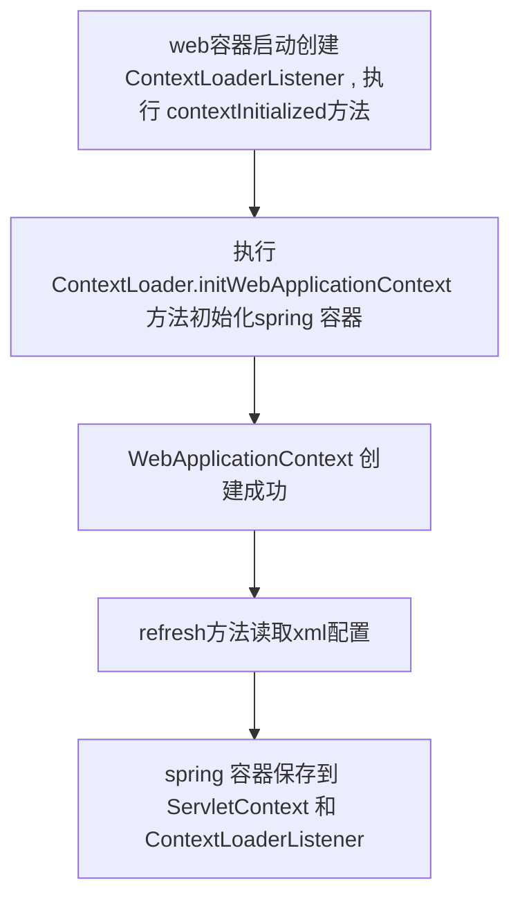
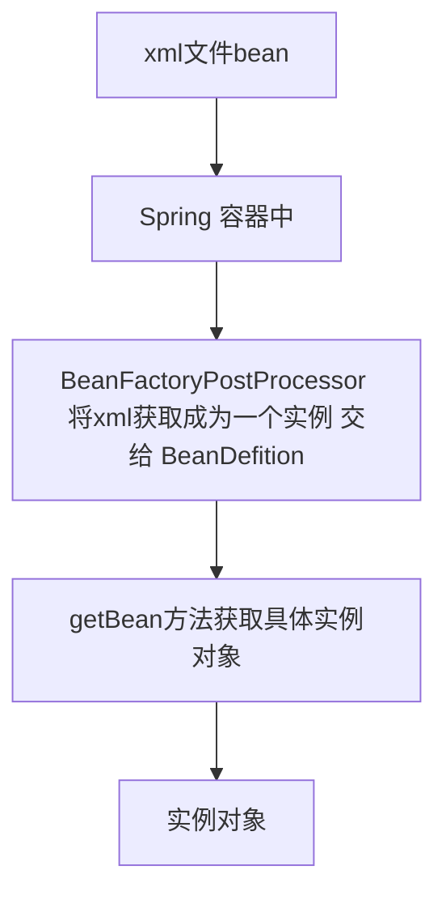

# Spring 相关问题

## 什么是IoC容器

IoC容器指的是Spring 中BeanFactory 的键值对结构（K-V） ， 储存了Bean的实例

## BeanFactory 有哪些

- ApplicationContext 
- BeanFactory 
- 底层DefaultListableBeanFactory

## ApplicationContext  和 BeanFactory  的区别

- BeanFactory 懒加载 ， 用的时候才有

- ApplicationContext  创建完了就有了 ， 加载applicationContext.xml 就完成了所有的Bean加载 （**单例才具备**）

  

---

## Ioc创建方式

- ClassPathXmlApplicationContext
  - 	类路径下获取
- FileSystemXmlApplicationContext
  - 文件路径获取
- AnnotationConfigApplicationContext

  - 注解形式获取

## web Ioc容器创建



## Bean 相关流程

### IoC bean获取



```java
	@Override
	public void refresh() throws BeansException, IllegalStateException {
		synchronized (this.startupShutdownMonitor) {
			// Prepare this context for refreshing.
			prepareRefresh();

			// Tell the subclass to refresh the internal bean factory.
			// Spring 容器的创建 org.springframework.beans.factory.support.DefaultListableBeanFactory
            // Bean信息加载类BeanDefition 
            // BeanDefinition 注册org.springframework.beans.factory.support.BeanDefinitionRegistry
            ConfigurableListableBeanFactory beanFactory = obtainFreshBeanFactory();

			// Prepare the bean factory for use in this context.
			prepareBeanFactory(beanFactory);

			try {
				// Allows post-processing of the bean factory in context subclasses.
				postProcessBeanFactory(beanFactory);

				// Invoke factory processors registered as beans in the context.
                // 将 BeanDefinitionRegistry 里面的bean 实例化 
				invokeBeanFactoryPostProcessors(beanFactory);

				// Register bean processors that intercept bean creation.
				// 注册BeanPostProcessors
                registerBeanPostProcessors(beanFactory);

				// Initialize message source for this context.
				initMessageSource();

				// Initialize event multicaster for this context.
				initApplicationEventMulticaster();

				// Initialize other special beans in specific context subclasses.
				onRefresh();

				// Check for listener beans and register them.
				registerListeners();

				// Instantiate all remaining (non-lazy-init) singletons.
				// 加载单例的bean
                finishBeanFactoryInitialization(beanFactory);

				// Last step: publish corresponding event.
				finishRefresh();
			}

			catch (BeansException ex) {
				if (logger.isWarnEnabled()) {
					logger.warn("Exception encountered during context initialization - " +
							"cancelling refresh attempt: " + ex);
				}

				// Destroy already created singletons to avoid dangling resources.
				destroyBeans();

				// Reset 'active' flag.
				cancelRefresh(ex);

				// Propagate exception to caller.
				throw ex;
			}

			finally {
				// Reset common introspection caches in Spring's core, since we
				// might not ever need metadata for singleton beans anymore...
				resetCommonCaches();
			}
		}
	}

```

- 所有涉及配置的都在org.springframework.beans.factory.config下

  ```java
  BeanDefinition
  BeanPostProcessor
  ```


-----

## **destroy-method** 的应用

建立数据库连接的时候需要指定一个销毁方法 ， 将数据库连接关闭

## Bean 的实例化

1. 无参构造
2. 静态工厂

## DI依赖注入

### 什么是依赖

- bean的属性

### 什么是依赖注入

~~将属性变成可修改的形式进行复制操作~~ 

### 依赖注入的方式

1. 构造方法注入
   1. 利用<constructor-arg name=*"id"* value=*"1"*></constructor-arg> 形式
2. **set方法注入**
   1. 利用<property name="target" ref="woman"></property>形式注入

### 注入类型

1. 简单类型 用value 关键字

2. 引用类型用 ref 关键字

3. 数组用 list标签

   ```xml
   <list>
   	<value>1</value>
       <bean></bean>
   </list>
   ```

4. map用Map标签

   ```xml
   <map>
   	<entry key="a" value="1"></entry>
   </map>
   ```

5. properties 用props标签

   ```xml
   <props>
       	<prop key="username">root</prop>
   </props>
   ```

   

---

## xml 和注解的优势

xml：

- 不用改源码

注解：

- 配置简单

