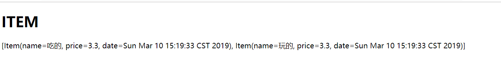
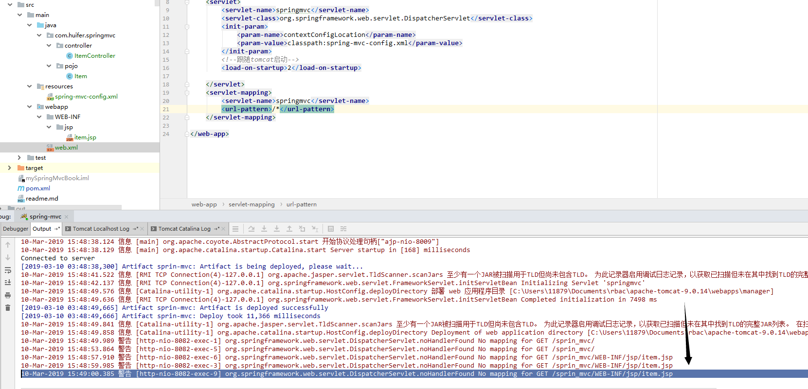
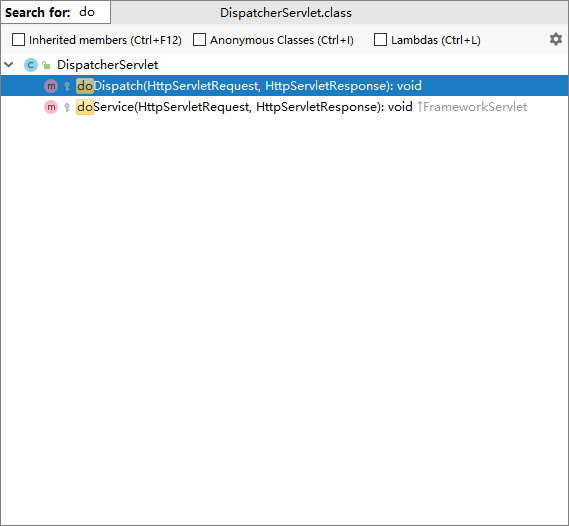
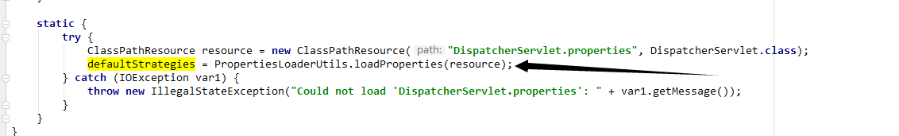
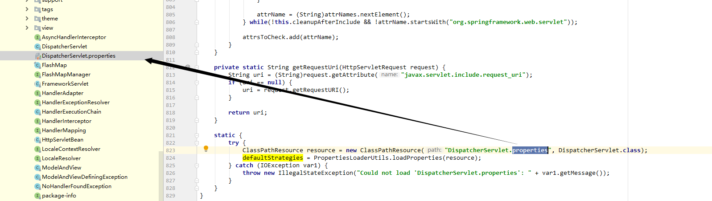
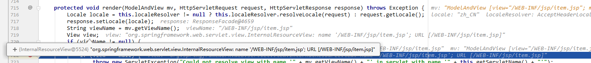
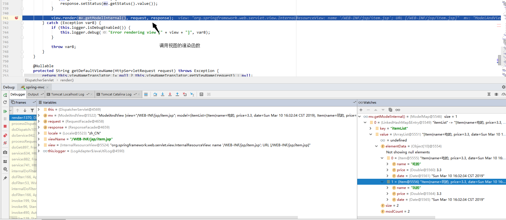

# SpringMvc

[【源码仓库】](https://github.com/wt1187982580/javaBook-src/tree/master/mySpringMvcBook)

## 三层结构

- 表现层
  - MVC模型

- 业务层
  - service 

- 持久层
  - dao

## 工作流程

```sequence
用户->前端控制器:用户发送请求
前端控制器-> 后端控制器:根据用户请求查询具体控制器
后端控制器-->前端控制器:处理后结果
前端控制器--> 视图:视图渲染
视图-->前端控制器:返回视图
前端控制器--> 用户:响应结果

```

## 简单案例

依赖

```java
<?xml version="1.0" encoding="UTF-8"?>
<project xmlns="http://maven.apache.org/POM/4.0.0"
         xmlns:xsi="http://www.w3.org/2001/XMLSchema-instance"
         xsi:schemaLocation="http://maven.apache.org/POM/4.0.0 http://maven.apache.org/xsd/maven-4.0.0.xsd">
    <modelVersion>4.0.0</modelVersion>

    <groupId>com.huifer</groupId>
    <artifactId>mySpringMvcBook</artifactId>
    <version>1.0-SNAPSHOT</version>

    <packaging>war</packaging>

    <properties>
        <project.build.sourceEncoding>UTF-8</project.build.sourceEncoding>
        <project.reporting.outputEncoding>UTF-8</project.reporting.outputEncoding>
        <java.version>1.8</java.version>
        <spring.version>5.1.5.RELEASE</spring.version>
        <junit.version>4.12</junit.version>
    </properties>

<dependencies>
    <dependency>
        <groupId>org.springframework</groupId>
        <artifactId>spring-beans</artifactId>
        <version>${spring.version}</version>
    </dependency>
    <dependency>
        <groupId>org.springframework</groupId>
        <artifactId>spring-core</artifactId>
        <version>${spring.version}</version>
    </dependency>
    <dependency>
        <groupId>org.springframework</groupId>
        <artifactId>spring-context</artifactId>
        <version>${spring.version}</version>
    </dependency>
    <dependency>
        <groupId>org.springframework</groupId>
        <artifactId>spring-expression</artifactId>
        <version>${spring.version}</version>
    </dependency>

    <dependency>
        <groupId>org.springframework</groupId>
        <artifactId>spring-aspects</artifactId>
        <version>${spring.version}</version>
    </dependency>
    <dependency>
        <groupId>aopalliance</groupId>
        <artifactId>aopalliance</artifactId>
        <version>1.0</version>
    </dependency>

    <dependency>
        <groupId>org.springframework</groupId>
        <artifactId>spring-webmvc</artifactId>
        <version>${spring.version}</version>
    </dependency>
    <dependency>
        <groupId>org.springframework</groupId>
        <artifactId>spring-web</artifactId>
        <version>${spring.version}</version>
    </dependency>


    <!-- https://mvnrepository.com/artifact/javax.servlet.jsp.jstl/jstl -->
    <dependency>
        <groupId>javax.servlet.jsp.jstl</groupId>
        <artifactId>jstl</artifactId>
        <version>1.2</version>
    </dependency>
    <dependency>
        <groupId>javax.servlet</groupId>
        <artifactId>servlet-api</artifactId>
        <version>2.5</version>
    </dependency>
    <dependency>
        <groupId>org.projectlombok</groupId>
        <artifactId>lombok</artifactId>
        <version>1.18.4</version>
    </dependency>
    <dependency>
        <groupId>com.fasterxml.jackson.core</groupId>
        <artifactId>jackson-databind</artifactId>
        <version>2.9.3</version>
    </dependency>
    <!-- https://mvnrepository.com/artifact/com.fasterxml.jackson.core/jackson-core -->
    <dependency>
        <groupId>com.fasterxml.jackson.core</groupId>
        <artifactId>jackson-core</artifactId>
        <version>2.9.3</version>
    </dependency>
    <!-- https://mvnrepository.com/artifact/com.fasterxml.jackson.core/jackson-annotations -->
    <dependency>
        <groupId>com.fasterxml.jackson.core</groupId>
        <artifactId>jackson-annotations</artifactId>
        <version>2.9.3</version>
    </dependency>
</dependencies>

    <build>
        <resources>
            <!--千千万万别忘记-->
            <resource>
                <directory>src/main/java</directory>
                <includes>
                    <include>**/*.xml</include>
                </includes>
            </resource>
        </resources>
        <plugins>
            <plugin>
                <groupId>org.apache.maven.plugins</groupId>
                <artifactId>maven-compiler-plugin</artifactId>
                <configuration>
                    <source>1.8</source>
                    <target>1.8</target>
                    <encoding>UTF-8</encoding>
                </configuration>
            </plugin>
        </plugins>
    </build>
</project>
```

spring-config

```XML
<?xml version="1.0" encoding="UTF-8"?>
<beans xmlns="http://www.springframework.org/schema/beans"
       xmlns:xsi="http://www.w3.org/2001/XMLSchema-instance"
       xmlns:context="http://www.springframework.org/schema/context"
       xmlns:mvc="http://www.springframework.org/schema/mvc"
       xsi:schemaLocation="http://www.springframework.org/schema/beans http://www.springframework.org/schema/beans/spring-beans.xsd http://www.springframework.org/schema/context http://www.springframework.org/schema/context/spring-context.xsd http://www.springframework.org/schema/mvc http://www.springframework.org/schema/mvc/spring-mvc.xsd">

    <context:component-scan base-package="com.huifer.springmvc"/>


    <!-- 配置注解的适配器和映射器，同时还注入了很多其他的bean -->
    <mvc:annotation-driven/>


</beans>
```

web.xml

```JAVA
<?xml version="1.0" encoding="UTF-8"?>
<web-app xmlns="http://xmlns.jcp.org/xml/ns/javaee"
         xmlns:xsi="http://www.w3.org/2001/XMLSchema-instance"
         xsi:schemaLocation="http://xmlns.jcp.org/xml/ns/javaee http://xmlns.jcp.org/xml/ns/javaee/web-app_4_0.xsd"
         version="4.0">


    <servlet>
        <servlet-name>springmvc</servlet-name>
        <servlet-class>org.springframework.web.servlet.DispatcherServlet</servlet-class>
        <init-param>
            <param-name>contextConfigLocation</param-name>
            <param-value>classpath:spring-mvc-config.xml</param-value>
        </init-param>
        <!--跟随tomcat启动-->
        <load-on-startup>2</load-on-startup>

    </servlet>
    <servlet-mapping>
        <servlet-name>springmvc</servlet-name>
        <url-pattern>/</url-pattern>
    </servlet-mapping>

</web-app>
```

- controller

  ```JAVA
  @Controller
  @RequestMapping("item")
  public class ItemController {
      @ResponseBody
      @GetMapping("/query")
      public ModelAndView query() throws Exception {
  
          List<Item> itemList = new ArrayList<>();
          itemList.add(new Item("吃的", 3.3, new Date()));
          itemList.add(new Item("玩的", 3.3, new Date()));
          ModelAndView modelAndView = new ModelAndView();
          modelAndView.addObject("itemList", itemList);
          modelAndView.setViewName("/WEB-INF/jsp/item.jsp");
          return modelAndView;
      }
  
  }
  ```

  

- item.JSP

  ```jsp
  <%--
    Created by IntelliJ IDEA.
    User: huifer
    Date: 2019/3/10
    Time: 11:26
    To change this template use File | Settings | File Templates.
  --%>
  <%@ page language="java" contentType="text/html; charset=UTF-8"
           pageEncoding="UTF-8" isELIgnored="false" %>
  <!DOCTYPE html PUBLIC "-//W3C//DTD HTML 4.01 Transitional//EN" "http://www.w3.org/TR/html4/loose.dtd">
  <html>
  <head>
      <title>ItemList</title>
  </head>
  <body>
  <h1>ITEM</h1>
  <p>${itemList}</p>
  </body>
  </html>
  ```

  

## web.xml 中的加载顺序

context-param->listener->filter->servlet

## url-parttern 匹配顺序

1. 精确匹配 ，如/baidu
2. 目录匹配，如/*
3. 拓展名匹配，如*.jpg
4. 默认匹配 ，如/

### tomcat中的url-parttern

- 文件在 ${tomcatHome}/conf/web.xml中

- 发布到tomcat的web应用共享下面两个配置

  ```xml
     <!-- The mapping for the default servlet -->
      <servlet-mapping>
          <servlet-name>default</servlet-name>
          <url-pattern>/</url-pattern>
      </servlet-mapping>
  
      <!-- The mappings for the JSP servlet -->
      <servlet-mapping>
          <servlet-name>jsp</servlet-name>
          <url-pattern>*.jsp</url-pattern>
          <url-pattern>*.jspx</url-pattern>
      </servlet-mapping>
  ```

  

### 此处面试题

为什么在自己的项目中web.xml配置/* 报错。如图



- 根据tomcat的web.xml配置可以看到 **/** 和**jsp**的拦截是分开的 ，而我们直接用一个**/***来拦截那么tomcat将不知道用什么来处理

## spring-mvc大致流程源码翻阅

- 从配置文件中知道前端控制器DispatcherServlet

```xml
<servlet>
    <servlet-name>springmvc</servlet-name>
    <servlet-class>org.springframework.web.servlet.DispatcherServlet</servlet-class>
    <init-param>
        <param-name>contextConfigLocation</param-name>
        <param-value>classpath:spring-mvc-config.xml</param-value>
    </init-param>
    <!--跟随tomcat启动-->
    <load-on-startup>2</load-on-startup>

</servlet>
```

在org.springframework.web.servlet.DispatcherServlet 看下面两个方法

 

- doService 将访问的数据接收到交给doDispatch
- doDispatch 具体调度

```JAVA
protected void doDispatch(HttpServletRequest request, HttpServletResponse response) throws Exception {
        HttpServletRequest processedRequest = request;
        HandlerExecutionChain mappedHandler = null;
        boolean multipartRequestParsed = false;
        WebAsyncManager asyncManager = WebAsyncUtils.getAsyncManager(request);

        try {
            try {
                ModelAndView mv = null;
                Object dispatchException = null;

                try {
                    processedRequest = this.checkMultipart(request);
                    multipartRequestParsed = processedRequest != request;
                   	// 加载handler
                    mappedHandler = this.getHandler(processedRequest);
                    if (mappedHandler == null) {
                        this.noHandlerFound(processedRequest, response);
                        return;
                    }
					// handler适配器
                    HandlerAdapter ha = this.getHandlerAdapter(mappedHandler.getHandler());
                    String method = request.getMethod();
                    boolean isGet = "GET".equals(method);
                    if (isGet || "HEAD".equals(method)) {
                        long lastModified = ha.getLastModified(request, mappedHandler.getHandler());
                        if ((new ServletWebRequest(request, response)).checkNotModified(lastModified) && isGet) {
                            return;
                        }
                    }

                    if (!mappedHandler.applyPreHandle(processedRequest, response)) {
                        return;
                    }
					// 适配器执行操作
                    mv = ha.handle(processedRequest, response, mappedHandler.getHandler());
                    if (asyncManager.isConcurrentHandlingStarted()) {
                        return;
                    }

                    this.applyDefaultViewName(processedRequest, mv);
                    mappedHandler.applyPostHandle(processedRequest, response, mv);
                } catch (Exception var20) {
                    dispatchException = var20;
                } catch (Throwable var21) {
                    dispatchException = new NestedServletException("Handler dispatch failed", var21);
                }
				// 操作结果返回
                this.processDispatchResult(processedRequest, response, mappedHandler, mv, (Exception)dispatchException);
            } catch (Exception var22) {
                this.triggerAfterCompletion(processedRequest, response, mappedHandler, var22);
            } catch (Throwable var23) {
                this.triggerAfterCompletion(processedRequest, response, mappedHandler, new NestedServletException("Handler processing failed", var23));
            }

        } finally {
            if (asyncManager.isConcurrentHandlingStarted()) {
                if (mappedHandler != null) {
                    mappedHandler.applyAfterConcurrentHandlingStarted(processedRequest, response);
                }
            } else if (multipartRequestParsed) {
                this.cleanupMultipart(processedRequest);
            }

        }
    }
```

- handler怎么来

  - initHandlerMappings(context)

  ```java
  protected void initStrategies(ApplicationContext context) {
          this.initMultipartResolver(context);
          this.initLocaleResolver(context);
          this.initThemeResolver(context);
          this.initHandlerMappings(context);
          this.initHandlerAdapters(context);
          this.initHandlerExceptionResolvers(context);
          this.initRequestToViewNameTranslator(context);
          this.initViewResolvers(context);
          this.initFlashMapManager(context);
      }
  ```

  ```java
      private void initHandlerMappings(ApplicationContext context) {
          this.handlerMappings = null;
          if (this.detectAllHandlerMappings) {
              Map<String, HandlerMapping> matchingBeans = BeanFactoryUtils.beansOfTypeIncludingAncestors(context, HandlerMapping.class, true, false);
              if (!matchingBeans.isEmpty()) {
                  this.handlerMappings = new ArrayList(matchingBeans.values());
                  AnnotationAwareOrderComparator.sort(this.handlerMappings);
              }
          } else {
              try {
                  HandlerMapping hm = (HandlerMapping)context.getBean("handlerMapping", HandlerMapping.class);
                  this.handlerMappings = Collections.singletonList(hm);
              } catch (NoSuchBeanDefinitionException var3) {
              }
          }
  
          if (this.handlerMappings == null) {
              // 读取默认配置文件
              this.handlerMappings = this.getDefaultStrategies(context, HandlerMapping.class);
              if (this.logger.isTraceEnabled()) {
                  this.logger.trace("No HandlerMappings declared for servlet '" + this.getServletName() + "': using default strategies from DispatcherServlet.properties");
              }
          }
  
      }
  ```

  
  - 默认配置文件

  

  

- handler适配器也在配置文件中

  ```java
  
      protected HandlerAdapter getHandlerAdapter(Object handler) throws ServletException {
          if (this.handlerAdapters != null) {
              Iterator var2 = this.handlerAdapters.iterator();
  
              while(var2.hasNext()) {
                  HandlerAdapter adapter = (HandlerAdapter)var2.next();
                	// 是否能够适配
                  if (adapter.supports(handler)) {
                      return adapter;
                  }
              }
          }
  
          throw new ServletException("No adapter for handler [" + handler + "]: The DispatcherServlet configuration needs to include a HandlerAdapter that supports this handler");
      }
  ```

  

  - HttpRequestHandlerAdapter

    ```java
    public class HttpRequestHandlerAdapter implements HandlerAdapter {
        public HttpRequestHandlerAdapter() {
        }
    // 判断是否是当前类支持的适配器
        public boolean supports(Object handler) {
            return handler instanceof HttpRequestHandler;
        }
    
    // 适配器执行操作
        @Nullable
        public ModelAndView handle(HttpServletRequest request, HttpServletResponse response, Object handler) throws Exception {
            ((HttpRequestHandler)handler).handleRequest(request, response);
            return null;
        }
    
        public long getLastModified(HttpServletRequest request, Object handler) {
            return handler instanceof LastModified ? ((LastModified)handler).getLastModified(request) : -1L;
        }
    }
    
    ```

    

- 视图解析

  ```java
   private void processDispatchResult(HttpServletRequest request, HttpServletResponse response, @Nullable HandlerExecutionChain mappedHandler, @Nullable ModelAndView mv, @Nullable Exception exception) throws Exception {
          boolean errorView = false;
          if (exception != null) {
              if (exception instanceof ModelAndViewDefiningException) {
                  this.logger.debug("ModelAndViewDefiningException encountered", exception);
                  mv = ((ModelAndViewDefiningException)exception).getModelAndView();
              } else {
                  Object handler = mappedHandler != null ? mappedHandler.getHandler() : null;
                  mv = this.processHandlerException(request, response, handler, exception);
                  errorView = mv != null;
              }
          }
  
          if (mv != null && !mv.wasCleared()) {
            	// 这个地方在做渲染
              this.render(mv, request, response);
              if (errorView) {
                  WebUtils.clearErrorRequestAttributes(request);
              }
          } else if (this.logger.isTraceEnabled()) {
              this.logger.trace("No view rendering, null ModelAndView returned.");
          }
  
          if (!WebAsyncUtils.getAsyncManager(request).isConcurrentHandlingStarted()) {
              if (mappedHandler != null) {
                  mappedHandler.triggerAfterCompletion(request, response, (Exception)null);
              }
  
          }
      }
  ```

  ```JAVA
  protected void render(ModelAndView mv, HttpServletRequest request, HttpServletResponse response) throws Exception {
          Locale locale = this.localeResolver != null ? this.localeResolver.resolveLocale(request) : request.getLocale();
          response.setLocale(locale);
          String viewName = mv.getViewName();
          View view;
          if (viewName != null) {
              // 视图解析器
              view = this.resolveViewName(viewName, mv.getModelInternal(), locale, request);
              if (view == null) {
                  throw new ServletException("Could not resolve view with name '" + mv.getViewName() + "' in servlet with name '" + this.getServletName() + "'");
              }
          } else {
              view = mv.getView();
              if (view == null) {
                  throw new ServletException("ModelAndView [" + mv + "] neither contains a view name nor a View object in servlet with name '" + this.getServletName() + "'");
              }
          }
  
          if (this.logger.isTraceEnabled()) {
              this.logger.trace("Rendering view [" + view + "] ");
          }
  
          try {
              if (mv.getStatus() != null) {
                  response.setStatus(mv.getStatus().value());
              }
  			// 视图的渲染函数渲染到页面上
              view.render(mv.getModelInternal(), request, response);
          } catch (Exception var8) {
              if (this.logger.isDebugEnabled()) {
                  this.logger.debug("Error rendering view [" + view + "]", var8);
              }
  
              throw var8;
          }
      }
  ```

  ```java
  @Nullable
  protected View resolveViewName(String viewName, @Nullable Map<String, Object> model, Locale locale, HttpServletRequest request) throws Exception {
      if (this.viewResolvers != null) {
          Iterator var5 = this.viewResolvers.iterator();
  
          while(var5.hasNext()) {
              // 视图解析器
              ViewResolver viewResolver = (ViewResolver)var5.next();
              View view = viewResolver.resolveViewName(viewName, locale);
              if (view != null) {
                  return view;
              }
          }
      }
  
      return null;
  }
  ```





## spring-mvc请求具体流程图

```sequence
用户->前端控制器\n org.springframework.web.servlet.DispatcherServlet\n 用来接收响应以及返回响应结果:1.用户发送请求 
前端控制器\n org.springframework.web.servlet.DispatcherServlet\n 用来接收响应以及返回响应结果 -> HandlerMapper : 2.根据url进行处理
HandlerMapper -> 前端控制器\n org.springframework.web.servlet.DispatcherServlet\n 用来接收响应以及返回响应结果:3.将handlerMapper处理结果给前端控制器
前端控制器\n org.springframework.web.servlet.DispatcherServlet\n 用来接收响应以及返回响应结果-> HandlerAdapter:4.给适配器确认具体的适配器，比如我们这里给了HttpRequestHandlerAdapter
HandlerAdapter ->ModelAndView:5.用来执行业务操作
ModelAndView ->HandlerAdapter: 6.执行完成给HandlerAdapter返回
HandlerAdapter->前端控制器\n org.springframework.web.servlet.DispatcherServlet\n 用来接收响应以及返回响应结果:7.返回一个modelAndView
前端控制器\n org.springframework.web.servlet.DispatcherServlet\n 用来接收响应以及返回响应结果-> ViewResolver 视图解析器 :8.将第7步中的view进行解析
ViewResolver 视图解析器->前端控制器\n org.springframework.web.servlet.DispatcherServlet\n 用来接收响应以及返回响应结果:9.解析结果返回
前端控制器\n org.springframework.web.servlet.DispatcherServlet\n 用来接收响应以及返回响应结果 -> View : 9.将model渲染到view中
View->前端控制器\n org.springframework.web.servlet.DispatcherServlet\n 用来接收响应以及返回响应结果: 10.view 结果返回给前端控制器
前端控制器\n org.springframework.web.servlet.DispatcherServlet\n 用来接收响应以及返回响应结果 --> 用户:查看到完整的网页
```

---

## SSM 整合单表操作

- 查询item表格
- 详细查看仓库
- 待解决问题 返回json