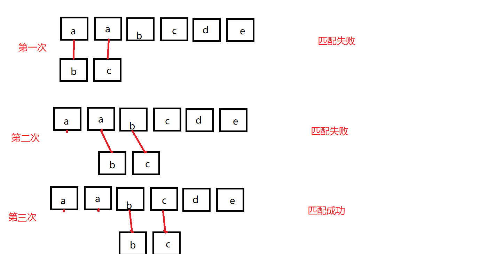
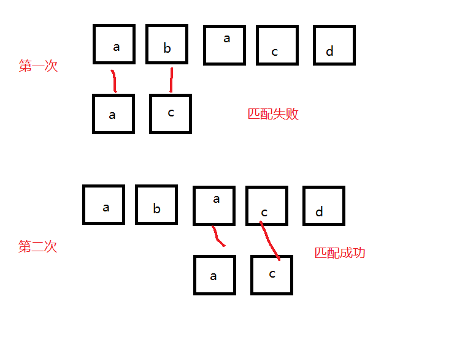
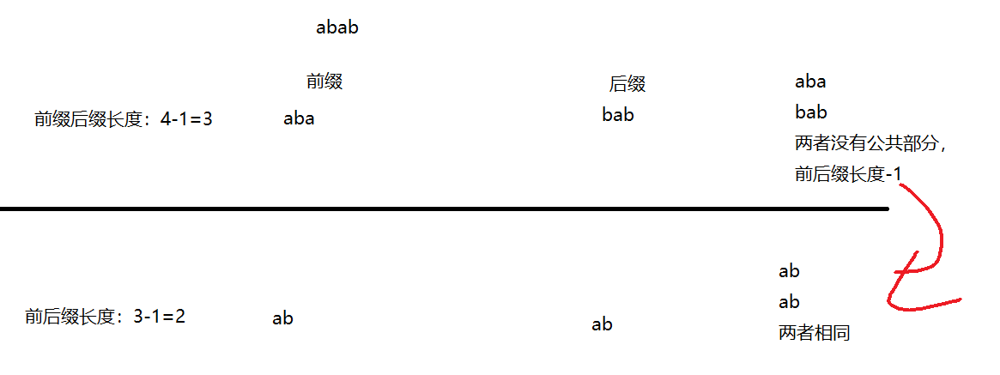
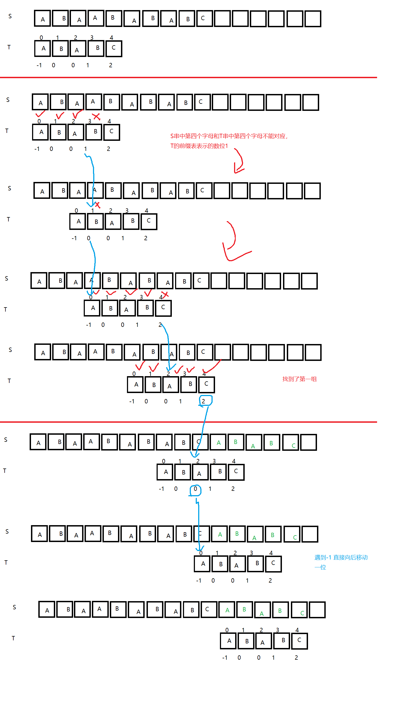

# 串

## 定义

- 由0个或多个字符组成的有限序列

## 字符串的抽象数据类型

```
ADT 串(String)
Data
	串中元素仅由一个字符组成，相邻元素具有前驱后继元素
	
Operation
	StrAassign(T,*chars):    生成一个其值等于字符串常量chars的串T
	StrCopy(T,S):    串S复制给串T
	ClearString(S):    清空串S
	StringEmpty(S):    若串S为空，返回true，否则返回false
	StrLength(S):    返回串的长度
	Concat(T,s1,s2):    用T接收s1 和 s2 拼接的新串
	SubString(Sub,S,pos,len):    用Sub接收串s的第pos个字符起长度为len的字串
	Index(S,T,pos):    若珠串S中存在和串T一样的字串，返回主串中第pos个字符之后出现的第一个位置，否则返回0
	Replace(S,T,V):    用V替换主串S中出现所有与T相等不重叠的字串
	StrInsert(S,pos,T):    在串S的第pos个字符前插入串T
	StrDelete(S,pos,len):    从串S中删除第pos个字符起长度为len的字串

endADT
```

## 模式匹配(BF)

- 确定主串中包含字串第一次出现的位置



```java
public class StringBF {

    public static void main(String[] args) {
        char[] s = {'a', 'a', 'b', 'c', 'd', 'e'};
        char[] t = {'b', 'c'};

        index_bf_2(s, t);

    }

    private static void index_bf_2(char[] s, char[] t) {
        int i = 0;
        int j = 0;
        int k;
        while (i < s.length && j < t.length) {

            if (s[i] == t[j]) {
                // 主串s 和字串t匹配 指针向后移动
                ++i;
                ++j;

            } else {
                // 不能匹配 ，ij指针回溯
                i = i - j + 2;
                j = 0;
            }
        }
        if (j >= t.length) {
             k = i - t.length;
        } else {
             k = 0;
        }
        System.out.println(k);
    }


    private static int index_bf(char[] s, char[] t) {
        int i = 0;
        int j = 0;
        for (; i < s.length; ) {
            if (j >= t.length - 1) {
                break;
            }
            if (s[i] == t[j]) {
                i = i + 1;
                j = j + 1;
            } else {
                i = i + 1;
            }
        }

        int i1 = i - t.length + 1;
        return i1;
    }

}
```

## KMP



### 前缀表 prefix table

- 对ababc 进行前缀表编写


| 序号 | 字符  | 最长公共前后缀 |
| ---- | ----- | -------------- |
| 1    | a     | 0              |
| 2    | ab    | 0              |
| 3    | aba   | 1              |
| 4    | abab  | 2              |
| 5    | ababc | 0              |

- 以abab为例 最长公共前后缀=2



- 构造前缀表

  - 在最前面添加-1 ，舍去最后一个值 ： -1，0，0，1，2

  $$
  a\quad b \quad a\quad b\quad c\\
  -1\quad 0\quad 0\quad 1\quad 2
  $$

  


### 匹配过程




```java
public class Kmp {


    public static void main(String[] args) {
        char[] pattern = "ABABCABAA".toCharArray();
        int n = pattern.length;
        int[] prefix = new int[n];
        prefixTable(pattern, prefix, n);
        movePrefixTable(prefix, n);
        kmpSearch("acABABCABAA".toCharArray(), pattern);
        System.out.println();
    }

    private static void kmpSearch(char[] text, char[] pattern) {
        int n = pattern.length-1;
        int[] prefix = new int[n];
        prefixTable(pattern, prefix, n);
        movePrefixTable(prefix, n);
        // text [i]  len(text) = m
        // pattern[j] len(pattern) = n
        int m = text.length-1;
        int i = 0;
        int j = 0;
        while (i < m ) {

            if (j == n - 1 && text[i] == pattern[j]) {
                System.out.println("匹配位置：" + (i - j));
                j = prefix[j];
            }
            if (text[i] == pattern[j]) {
                i++;
                j++;
            } else {
                j = prefix[j];
                if (j == -1) {
                    i++;
                    j++;
                }
            }
        }


    }

    /**
     * 前缀表后移一位
     */
    private static void movePrefixTable(int[] prefix, int n) {
        for (int i = n - 1; i > 0; i--) {
            prefix[i] = prefix[i - 1];
        }
        prefix[0] = -1;
    }

    /**
     * 前缀表
     */
    private static void prefixTable(char[] pattern, int[] prefix, int n) {
        prefix[0] = 0;
        int len = 0;
        int i = 1;
        while (i < n) {
            if (pattern[i] == pattern[len]) {
                len++;
                prefix[i] = len;
                i++;
            } else {
                if (len > 0) {
                    len = prefix[len - 1];
                } else {
                    prefix[i] = len;
                    i++;
                }
            }
        }
    }
}
```