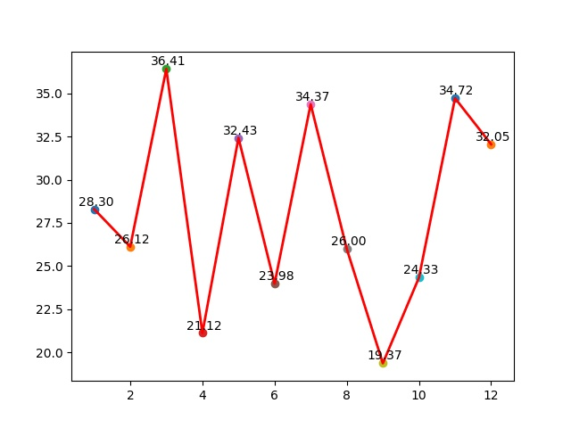

---

---

# 数据

## 概率

### 排列组合

1. 扔硬币

   投掷质地均匀的硬币N次，求正面、反面出现的概率

   | 次数 | 正、反 |
   | ---- | ------ |
   | 1    | 正     |
   | 2    | 反     |
   | ...  | ...    |

- 下面这段代码模拟投掷硬币，求正反面出现的概率，当 投掷数量越大(count 越大) 概率就更接近0.5

```java
public class Coin {

    public static void main(String[] args) {
        int count = 100;
        int front = 0;
        int verso = 0;

        for (int i = 0; i < count; i++) {
            double random = Math.random();
            if (random > 0.5) {
                verso += 1;
            } else {
                front += 1;
            }
        }
        double f1 = new BigDecimal((float)front/count).setScale(2, BigDecimal.ROUND_HALF_UP).doubleValue();
        double f2 = new BigDecimal((float)verso/count).setScale(2, BigDecimal.ROUND_HALF_UP).doubleValue();
        System.out.println("正面的概率 = " + f1);
        System.out.println("反面的概率 = " + f2);
    }

}
```


### 古典概型

- 包含单位事件的可能不唯一

1. 扔骰子 , 骰子朝上一面的和为s ， 求n个骰子 s 出现的概率

   ```java
   public class Dice {
   
       public static void main(String[] args) {
           int size = 2;
           calc(size);
           System.out.println();
       }
   
   
       public static void calc(int size) {
           int g_maxValue = 6;
           if (size < 1) {
               return;
           }
           int maxSum = size * g_maxValue;
           int[][] probabilities = new int[2][maxSum + 1];
           // 通过falg来循环利用数组
           int flag = 0;
           // 初始化第一个骰子
           for (int i = 1; i <= g_maxValue; i++) {
               probabilities[flag][i] = 1;
           }
           // 第二个骰子到第n个骰子
           for (int k = 2; k <= size; k++) {
               flag = 1 - flag;
               // 当骰子数为k，那么sum的范围为k到k*g_maxValue
               for (int i = 1; i < k; i++) {
                   probabilities[flag][i] = 0;
               }
               //k个骰子的最小和为k，k之前的数设为0；
               for (int i = k; i <= g_maxValue * k; i++) {
                   int count = 1;
                   //要把f(n)先设为0再进行计算
                   probabilities[flag][i] = 0;
                   while (i - count > 0 && count <= 6) {
                       probabilities[flag][i] += probabilities[1 - flag][i - count];
                       count++;
                   }
               }
           }
           System.out.print("循环实现：");
           double total = Math.pow((double) g_maxValue, (double) size);
           // 打印出从number到maxSum每个数字出现的概率
           DecimalFormat df = new DecimalFormat("0.000");
           for (int i = size; i <= maxSum; i++) {
               System.out.println( "数字 "+ i +"\t概率:\t"+  df.format(probabilities[flag][i] / total) + " ");
           }
       }
   
   
   }
   ```


---


## 统计

### 加和值

- 数字的总和 1+2+...+n
  $$
  （x_1+x_2+....+x_n)
  $$
  

### 平均值

- 数字的平均值 
  $$
  \overline{X} = \frac{1}{n}*（x_1+x_2+....+x_n)
  $$
  

### 方差

- 表示数据集中数据点的离散程度

$$
σ^2 = \frac{1}{n}*\sum_{n=1}^{n}{(X_i -\overline{X} )^2}
$$


### 标准差

$$
σ = \sqrt{ \frac{1}{n}*\sum_{n=1}^{n}{(X_i -\overline{X} )^2}}
$$


- 平均值例子

  ```python
  #! /usr/bin/env python
  # -*- coding: utf-8 -*-
  import numpy as np
  import matplotlib.pyplot as plt
  
  n = 10
  
  # 0-100之间随机 n 个数字
  arr = np.random.randint(0, 100, n)
  # 求均值
  arr_mean = np.mean(arr)
  # 求方差
  arr_var = np.var(arr)
  # 求标准差
  arr_std = np.std(arr, ddof=1)
  print("平均值为：%f" % arr_mean)
  print("方差为：%f" % arr_var)
  print("标准差为:%f" % arr_std)
  
  plt.figure(figsize=(9, 6))
  plt.ylim(0, 100)
  plt.xlim(0, n + 1)
  
  X = np.arange(n) + 1
  # 柱状图表示分数
  plt.bar(X, arr, alpha=0.9, width=0.35, facecolor='lightskyblue', edgecolor='white', label='score', lw=1)
  # 水平线
  plt.hlines(arr_mean, 0, n + 1, colors="red", linestyles="dashed" , label= "mean")
  
  
  
  plt.legend()
  
  plt.savefig('./平均值.jpg')
  plt.show()
  
  ```

  


- 标准差例子

  ```python
  #! /usr/bin/env python
  # -*- coding: utf-8 -*-
  # 一个班级12次月考的标准差
  import numpy as np
  import matplotlib.pyplot as plt
  n = 10
  
  x_list = []
  mean_list = []
  std_list = []
  
  
  
  for i in range(12):
      x1 = np.random.randint(0, 100, n)
      mean1 = np.mean(x1)
      std_1 = np.std(x1)
      x_list.append(x1)
      mean_list.append(mean1)
      std_list.append(std_1)
  
  X = np.arange(12) + 1
  
  plt.plot(X, std_list, linewidth='2', color="red")
  
  for x,y in zip(X,std_list):
      plt.scatter(x, y)
      plt.text(x+0.05,y+0.05,'%.2f' %y, ha='center',va='bottom')
  
  plt.savefig('./标准差.jpg')
  plt.show()
  ```

  

### 加权均值

- 在和面的时候 放入400克面粉 ，水100 克 ， 水:面粉(1:4)
- 单个物体或事物在整体一件事情种所占的权重
- 公式：

$$
\overline{X} = \frac{x_1*w_1+x_2*w_2+....+x_n*w_n}{w_1+w_2+...+w_n}
$$

```python
import numpy as np

n = 10

# 0-100之间随机 n 个数字
arr = np.random.randint(0, 100, n)


weight_mean = np.average(arr , weights= np.random.randint(0, 5, n))
print("加权平均值为：%f" % weight_mean)
```

#### 决策平衡

- 决策平衡在一下方面做出平衡
  1. 不同目标与准则之间的平衡
  2. 不同时间的平衡
  3. 收益与风险之间的平衡


股东投票，配合股票占有率(加权值) 进行决策的通过性，摒弃一票否决之类


### 众数

- 在统计分布上具有明显集中趋势点的数值，代表数据的一般水平（众数可以不存在或多于一个）


### 中位数

- 代表一个样本、种群或概率分布中的一个数值，其可将数值集合划分为相等的上下两部分。


- 众数&中位数例子

```python
import numpy as np

arr = [1, 2, 1, 1, 2, 3, 1, 2, 2, 2, 2, 2]

# 众数
counts = np.bincount(arr)
mode = np.argmax(counts)
# 中位数
median = np.median(arr)

print("众数为：%f" % mode)
print("中位数为：%f" % median)
```


### 欧氏距离

- 在数学中，欧几里得距离或欧几里得度量是欧几里得空间中两点间“普通”（即直线）距离。使用这个距离，欧氏空间成为度量空间

#### 二维空间

$$
c = \sqrt{(x_2-x_1)^2+(y_2-y_1)^2}
$$


#### 三维空间

$$
c = \sqrt{(x_2-x_1)^2+(y_2-y_1)^2+(z_2-z_1)^2}
$$


#### n 维空间

$$
c  = \sqrt{(x_1-y_1)^2+(x_2-y_2)^2+...+(x_n-y_n)^2)} = \sqrt{\sum_{i=1}^{n}(x_i-y_i)^2}
$$


```python
import numpy as np

a_1 = 3
b_1 = 4

dist_1 = np.square(a_1 - b_1)

a = [1, 2, 3]
b = [3, 4, 5]

vec1 = np.array(a)
vec2 = np.array(b)

# 方法一
distance = np.sqrt(np.sum(np.square(vec1 - vec2)))

# 方法二
dist = np.linalg.norm(vec1 - vec2)
```


### 曼哈顿距离

用以标明两个点在标准坐标系上的绝对轴距总和。
$$
c = |x_1-x_2|+|y_1-y_2|
$$

```python
from numpy import *

vector1 = mat([1, 2, 3])
vector2 = mat([4, 5, 6])
# 公式法
mhd = sum(abs(vector1 - vector2))

print("曼哈顿距离 ： %.2f" % mhd)
```


### 抽样

- 冲研究样本种提取一部分进行操作


#### demo

- pandas

  - ```python
    def sample(self, n=None, frac=None, replace=False, weights=None,
               random_state=None, axis=None):
    ```

    - 参数说明
      1. n :样本抽取量，整数
      2. frac :抽取比例，小数 ，抽取20% 填写0.2
      3. replace:抽样数据是否替换df
      4. weights:加权，默认为None (等概率加权)
      5. random_state:随机种子，如果设置实数每次结果都一样
      6. axis:抽取为行还是列，0为行，1为列

- numpy

  - ```python
    def choice(a, size=None, replace=True, p=None):
    ```

    - 参数说明
      1. a:抽取样本
      2. size:样本抽取量，整数
      3. replace：是否存在重复值 
      4. p:类型一维数组，是否一致分布

```python
import pandas as pd
import numpy as np

arr = np.random.randint(0, 10, 100)
df = pd.DataFrame(arr)
# 抽样1 pandas
sample_1 = df.sample(n=10)
print("抽样1")
print(sample_1)

# 抽样2 numpy
sample_2 = np.random.choice(arr, 5)
print("抽样2")
print(sample_2)
```

---


## 分布

### 高斯分布(正态分布)

#### 定义

> 正态曲线呈钟型，两头低，中间高，左右对称因其曲线呈钟形，因此人们又经常称之为钟形曲线。


#### 特征

1. 集中性：正态曲线的高峰位于正中央，及平均值所在处
2. 对称性：正态曲线以均值为中心，左右对称，曲线两端永不横向相交
3. 均匀变动性：正态曲线从均值开始，分别向左右两侧逐渐均匀下降

#### 概率密度函数

##### 一维正态分布

- 若随机变量X  服从一个位置参数为μ  、尺度参数为σ的概率分布，有一下公式

$$
f(x) = \frac{1}{\sqrt{2	\Pi σ} }*exp(-\frac{(x-μ)^2}{2σ^2})
$$

##### 标准正态分布

- **当μ =0，σ=1 时**，正态分布成为标准正态分布

$$
f(x) = \frac{1}{\sqrt{2	\Pi σ} }*exp^(-\frac{x^2}{2})
$$


#### 规律

1. μ越大，函数图像的中轴向右移动
2. μ越小，函数图像的中轴向左移动
3. σ越大，函数图像越宽
4. σ越小，函数图像越窄


#### demo

```python
import numpy as np
import matplotlib.pyplot as plt
import math

# 均值μ
u = 0
u01 = -2
# 标准差σ
sig = math.sqrt(0.2)
x = np.linspace(u - 3 * sig, u + 3 * sig, 50)
y_sig = np.exp(-(x - u) ** 2 / (2 * sig ** 2)) / (math.sqrt(2 * math.pi) * sig)
print(x)
print("=" * 20)
print(y_sig)
plt.plot(x, y_sig, "r-", linewidth=2)
plt.grid(True)
plt.savefig("./正态分布.jpg")
plt.show()

```


### 泊松分布

- 泊松分布是一种离散概率分布	
- 泊松分布适合用于描述单位时间内随机事件的发生次数
- 泊松分布适用的事件需要满足如下3个条件
  1. 这个事件是一个小概率事件
  2. 事件的每次发生都是独立存在，不会互相影响
  3. 事件的概率是稳定的

#### 概率函数

$$
P(X=K) = \frac{\lambda^k}{k!}e^{-\lambda}  ,k=0,1,2,3,4....
$$

- 参数说明

$$
\lambda 含义：单位时间（单位面积）内随机时间的平均发生率
$$


#### demo

```python
#%% md
# 泊松分布


#%%
import numpy as np
import scipy.stats as stats
import matplotlib.pyplot as plt

n = np.arange(0,10)

# 绘制泊松分布的概率密度函数
plt.bar(n,height=(stats.poisson.pmf(n,mu=np.mean(n))),width=0.75,alpha=0.75)
# 绘制泊松分布的累计概率曲线
plt.plot(n,stats.poisson.cdf(n,mu=np.mean(n)),color="#fc4f30")

plt.show()


#%% md
- 泊松分布不同的 $$\lambda$$ 值，函数曲线的变化情况 

#%% 
plt.scatter(n,stats.poisson.cdf(n,mu=1),color="#fc4f30",label= "$\lambda$=1")
plt.plot(n,stats.poisson.cdf(n,mu=1),color="#fc4f30")

plt.scatter(n,stats.poisson.cdf(n,mu=2),color="#00FFFF",label= "$\lambda$=2")
plt.plot(n,stats.poisson.cdf(n,mu=2),color="#00FFFF")

plt.scatter(n,stats.poisson.cdf(n,mu=5),color="#FFA07A",label= "$\lambda$=5")
plt.plot(n,stats.poisson.cdf(n,mu=5),color="#FFA07A")


plt.legend()

plt.show()
```


### 伯努利分布

定义

> 伯努利分布亦称“零一分布”、“两点分布”。称随机变量X有伯努利分布, 参数为p(0<p<1),如果它分别以概率p和1-p取1和0为值。EX= p,DX=p(1-p)。伯努利试验成功的次数服从伯努利分布,参数p是试验成功的概率。伯努利分布是一个离散型机率分布，是N=1时二项分布的特殊情况


#### 伯努利分布的分布律


$$
P_n =\begin{cases}p  & n = 1\\1-p & n=0\\\end{cases}
$$

- 上述公式为一个分段函数进行二次修改
  $$
  P(n)= p^n(1-p)^{1-n}
  $$
  

#### 满足条件

1. 每一个事件之间是互相独立
2. 每一个事件只有两个结果 n=0 或 n=1


#### 泊松分布的验证

$$
P(X=k) = C_n^k*p^k(1-p)^{n-k}
$$

##### 参数说明

1. X 事件发生的次数

2. $$
   C_n^k  指的是组合，等价于 \frac{n!}{k!(n-k)!}
   $$

3. $$
   p^k(1-p)^{n-k}  指的是o的n次幂与(1-p)的(1-p)次幂的乘积
   $$

   

- 如果实验满足下面公式
  $$
  P（n) =p^n(1-p)^{1-n}
  $$
  的伯努利分布，那么在连续实验n次的情况下，n=1发生k次的概率为
  $$
  C_n^k*p^k(1-p)^{n-k}
  $$
  

#### 数学题

张三参加考试通过率为1/3 ,不通过率为2/3,连续参加4次考试，通过2次的概率为多少

#### 解

如题可知参数P=1/3 ，  n = 4 , k = 2
$$
C_4^2 *(\frac{1}{3})^2*[1-(\frac{1}{3})]^{(4-2)} = \frac{4*3}{2*1}*\frac{1}{9}*\frac{4}{9} = \frac{8}{27}
$$

#### demo

- 接上题

```python
from scipy.stats import binom   
# 实验次数
n = 4
# 概率
p = 1/3
# 导入特征系数
k = 2
#伯努利分布计算
binomial = binom.pmf(k, n, p)
print("张三参加考试通过率为1/3 ,不通过率为2/3,连续参加4次考试，通过2次的概率为%.4f"%(binomial))
```

- 伯努利分布的可视化

```python
from scipy.stats import binom
import matplotlib.pyplot as plt
import numpy as np
# 实验次数
n = 20
# 概率
p = 0.5
# 导入特征系数
k = np.arange(0, 21)
# 伯努利分布计算
binomial = binom.pmf(k, n, p)
plt.plot(k, binomial, 'o-')
plt.title('Binomial: n = %i, p=%0.2f' % (n, p), fontsize=15)
plt.xlabel('Number of successes')
plt.ylabel('Probability of sucesses', fontsize=15)
plt.savefig('./伯努利分布.jpg')
plt.show()
```


---


## 聚类

> 将物理或抽象对象的集合分成由类似的对象组成的多个类的过程被称为聚类。


### K-Means 算法

> K均值聚类算法是先随机选取K个对象作为初始的聚类中心。然后计算每个对象与各个种子聚类中心之间的距离，把每个对象分配给距离它最近的聚类中心。聚类中心以及分配给它们的对象就代表一个聚类。一旦全部对象都被分配了，每个聚类的聚类中心会根据聚类中现有的对象被重新计算。这个过程将不断重复直到满足某个终止条件。终止条件可以是没有（或最小数目）对象被重新分配给不同的聚类，没有（或最小数目）聚类中心再发生变化，误差平方和局部最小。


#### 算法流程

前提条件

- 指定类簇的数量
- 提前给定初始类中心


1. 从n个向量对象中随机选择k个作为初始聚类中心
2. 在(1)设置的k个向量(中心对象向量) ， 计算每个对象与k个中心对象的距离
3. 在(2)中计算，任何一个向量与k个向量都有一个距离，将向量与距离它最近的中心向量对象归类在一个类簇中
4. 重新计算每一个类簇的中心对象向量位置
5. 重复 (3), (4) 直到类簇聚类方案中的向量归类变化极小为止


#### demo

```python
from sklearn.cluster import KMeans
import random
import matplotlib.pyplot as plt

point_random = []
for i in range(100):
    rx = random.uniform(0, 100)
    ry = random.uniform(0, 100)
    point_random.append([rx, ry])

# kmean 簇族 分组量
group_size = 3
clf = KMeans(n_clusters=group_size)
cluster_group = clf.fit_predict(point_random)

cnames = ['black', 'blue', 'red']

point_kmean = []

for point, gp_id in zip(point_random, cluster_group):
    point_kmean.append([point, gp_id])
    # 放到 plt 中展示
    plt.scatter(point[0], point[1], s=5, c=cnames[gp_id], alpha=1)

plt.show()
```


### 孤立点

- 孤立点一般是离主群 或 每一个群都非常远的点

- 在一组样本数据中孤立点和这组样本数据的个体差异明显


### 层次聚类


```python
cls = AgglomerativeClustering(n_clusters=group_size,linkage='ward')
```

- linkage 参数说明:

    1. ward (默认值)：每一个类簇的方差最小化
    2. average：每一个类簇之间的距离的平均值最小
    3. complete：每一个类簇之间的距离最大
    4. single：每一个类簇之间的距离最小

    ```text
    linkage : {"ward", "complete", "average", "single"}, optional \
            (default="ward")
        Which linkage criterion to use. The linkage criterion determines which
        distance to use between sets of observation. The algorithm will merge
        the pairs of cluster that minimize this criterion.

        - ward minimizes the variance of the clusters being merged.
        - average uses the average of the distances of each observation of
          the two sets.
        - complete or maximum linkage uses the maximum distances between
          all observations of the two sets.
        - single uses the minimum of the distances between all observations
          of the two sets.
    ```


- 属性
  1. labels_：样本簇标记
  2. n_leaves_：分层树的叶节点数量
  3. n_components：连接图中连通分量的估计值

#### demo


- 年收入和年支出的对照表


| id   |  sex   | age  | annual_income | annual_expenditure |
| ---- | :----: | ---- | ------------: | -----------------: |
| 1    |  Male  | 19   |            15 |                 13 |
| 2    |  Male  | 21   |            15 |                 81 |
| 3    | Female | 20   |            16 |                 13 |
| 4    | Female | 23   |            16 |                 77 |
| 5    | Female | 31   |            17 |                 40 |
| 6    | Female | 22   |            17 |                  1 |
| 7    | Female | 35   |            18 |                  6 |
| 8    | Female | 23   |            18 |                 94 |
| 9    |  Male  | 64   |            19 |                  3 |
| 10   | Female | 30   |            19 |                 72 |
| 11   |  Male  | 67   |            19 |                 14 |
| 12   | Female | 35   |            19 |                 99 |

```python
#%%

import matplotlib.pyplot as plt  
import pandas as pd  
import numpy as np
import scipy.cluster.hierarchy as shc
customer_data = pd.read_csv(r'.\shopping_data.csv')  


# 获取收入和支出
data = customer_data.iloc[:, 3:5].values  


plt.figure(figsize=(10, 7))  
plt.title("Customer Dendograms")  
dend = shc.dendrogram(shc.linkage(data, method='ward'))  
plt.savefig("./收支-01.jpg")
plt.show()
#%%

from sklearn.cluster import AgglomerativeClustering

cluster = AgglomerativeClustering(n_clusters=5, affinity='euclidean', linkage='ward')  
cluster.fit_predict(data) 


plt.figure(figsize=(10, 7))  
plt.scatter(data[:,0], data[:,1], c=cluster.labels_, cmap='rainbosw')  
plt.savefig("./收支-02.jpg")
plt.show()
```


### 密度聚类

> 具有噪声的基于密度的聚类方法)是一种很典型的密度聚类算法，和K-Means，BIRCH这些一般只适用于凸样本集的聚类相比，DBSCAN既可以适用于凸样本集，也可以适用于非凸样本集


```python
cls = DBSCAN(eps=2000, min_samples=1)
```

#### 参数说明

- eps

  - 设置阈值，在根据密度向外拓展的过程中如果发现在这个阈值距离范围内找不到向量，那么就认为这个簇族查询完成

  

- min_samples

  - 告诉DBSCAN算法 每一个簇族最小应该拥有多少个向量，如果这个数字等于3，那么算法会认为小于3个向量的簇族为噪点，在结果中丢弃不显示


#### 案例

- 下表为国家人口面积统计表
- 对国家面积和人口进行密度聚类

| 排名 | 国家       | 人口：万人 | 面积：万Km2 | 人口密度：人口/ Km2 |
| ---- | ---------- | ---------- | ----------- | ------------------- |
| 1    | 中国       | 132256     | 959.7       | 138                 |
| 2    | 印度       | 109535     | 328.76      | 333                 |
| 3    | 美国       | 30071      | 982.66      | 31                  |
| 4    | 印度尼西亚 | 24545      | 191.94      | 128                 |
| 5    | 巴西       | 18808      | 851.2       | 22                  |
| 6    | 巴基斯坦   | 16580      | 80.39       | 206                 |
| 7    | 孟加拉国   | 14737      | 14.4        | 1023                |
| 8    | 俄罗斯     | 14289      | 1707.52     | 8                   |
| 9    | 尼日利亚   | 13186      | 92.38       | 143                 |
| 10   | 日本       | 12762      | 37.78       | 338                 |
| 11   | 墨西哥     | 10745      | 197.26      | 54                  |
| 12   | 菲律宾     | 8947       | 30          | 298                 |
| 13   | 越南       | 8440       | 32.96       | 256                 |
| 14   | 德国       | 8245       | 35.7        | 231                 |
| 15   | 埃及       | 7889       | 100.15      | 79                  |
| 16   | 土耳其     | 7041       | 78.06       | 90                  |
| 17   | 伊朗       | 7005       | 164.8       | 42                  |
| 18   | 泰国       | 6463       | 51.4        | 126                 |
| 19   | 法国       | 6088       | 54.7        | 111                 |
| 20   | 英国       | 6060       | 24.48       | 248                 |


```python
#! /usr/bin/env python
# -*- coding: utf-8 -*-
# __file__: 密度聚类
import numpy as np
import matplotlib.pyplot as plt
from sklearn.cluster import DBSCAN
from matplotlib.markers import MarkerStyle

X = [
    [132256, 959.7],
    [109535, 328.76],
    [30071, 982.66],
    [24545, 191.94],
    [18808, 851.2],
    [16580, 80.39],
    [14737, 14.4],
    [14289, 1707.52],
    [13186, 92.38],
    [12762, 37.78],
    [10745, 197.26],
    [8947, 30],
    [8440, 32.96],
    [8245, 35.7],
    [7889, 100.15],
    [7041, 78.06],
    [7005, 164.8],
    [6463, 51.4],
    [6088, 54.7],
    [6060, 24.48],

]

X = np.array(X)

a = X[:, :1]
b = X[:, 1:]*77.45


X = np.concatenate((a, b), axis=1)

# 没有噪点 min_samples 设置为1
cls = DBSCAN(eps=2000, min_samples=1)
cluster_group = cls.fit_predict(X)

# # 类簇量
n_clusters = len(set(cls.labels_))
markers = MarkerStyle.markers

for i in range(n_clusters):
    my_me = cls.labels_ = i
    plt.scatter(X[my_me, 0], X[my_me, 1],marker=list(markers.keys())[i], s=60, c='b', alpha=0.5)

plt.show()

```


- 注：77.45 主要用来归一化 ，  计算流程 a 的最大值 ， b 的最大值 ，较大值除以较小值 ， 将数据控制到同一个纬度中


## 矩阵

### 二维矩阵

$$
A =\begin{bmatrix}
        a_{11}  & a_{12} & a_{13} \\
        a_{21} & a_{22} & a_{23} \\
        a_{31} & a_{32} & a_{33} \\
           a_{41} & a_{42} & a_{43} \\
        \end{bmatrix}
$$

如上A就是一个矩阵 ，我们说A是一个4X3的矩阵 (m行Xn列  )， 


#### 矩阵加法

矩阵B + 矩阵A ， 规则就是相同位置的值相加， 且两个矩阵的m , n 都相等
$$
A =\begin{bmatrix}
       1  & 2 &3 \\
        4 & 5 & 6 \\
        \end{bmatrix}
        
       \\
       B =\begin{bmatrix}
       0  & 2 &0 \\
        2 & 0 & 2 \\
        \end{bmatrix}
        \\
        A+B = \begin{bmatrix}
       0+1  & 2+2 &0+3 \\
        2+4 & 0+5 & 2+6 \\
        \end{bmatrix} = 
        \begin{bmatrix}
       1  & 4 &3 \\
        6 & 5 & 8 \\
        \end{bmatrix}
$$


#### 矩阵减法

矩阵B - 矩阵A ， 规则就是相同位置的值相加， 且两个矩阵的m , n 都相等
$$
A =\begin{bmatrix}
       1  & 2 &3 \\
        4 & 5 & 6 \\
        \end{bmatrix}
        
       \\
       B =\begin{bmatrix}
       0  & 2 &0 \\
        2 & 0 & 2 \\
        \end{bmatrix}
        \\
        A-B = \begin{bmatrix}
       0-1  & 2-2 &0-3 \\
        2-4 & 0-5 & 2-6 \\
        \end{bmatrix} = 
        \begin{bmatrix}
       -1  & 0 & -3 \\
        -2 & -5 & -4 \\
        \end{bmatrix}
$$


#### 矩阵数乘

矩阵的每一个元素都乘以这个数
$$
A =\begin{bmatrix}
       1  & 2 &3 \\
        4 & 5 & 6 \\
        \end{bmatrix}
        \\
        2XA = \begin{bmatrix}
       1*2  & 2*2 &3*2 \\
        4*2 & 5*2 & 6*2 \\
        \end{bmatrix} = 
        \begin{bmatrix}
      2 & 4 &6 \\
        8 & 10 & 12 \\
        \end{bmatrix}
$$

#### 矩阵转置

矩阵转置，沿着对角线反转 ， 行列交换
$$
A =\begin{bmatrix}
       1  & 2 &3 \\
        4 & 5 & 6 \\
        \end{bmatrix}
        \\
        B=A^T = \begin{bmatrix}
       1  & 4 \\
        2 & 5 \\
        3 & 6\\
        \end{bmatrix}
$$


#### demo

```python
import numpy as np

A = np.mat( np.array(
    [   
        [1,2,3],
        [4,5,6],
    ]
))
B =np.mat( np.array(
    [   
        [0,2,0],
        [2,0,2],
    ]
))
# 矩阵加法
sum_a_b = A+B
print(sum_a_b)
# 矩阵减法
sub_a_b = A-B
print(sub_a_b)
# 矩阵数乘
a_2  = 2*A
print(a_2)
# 矩阵转置
at = A.T
print(at)
# 矩阵求逆
ai = A.I
print(ai)
```

### 上卷（Rollup）&下钻(Drilldown)

- 上卷
  - 数据级别增加，比如 huawei p20,iphone 5 上卷为 手机
- 下钻
  - 数据级别变小，比如手机下钻 有 huawei p20,iphone 5 

## 回归

### 线性回归

> 线性回归是利用数理统计中回归分析，来确定两种或两种以上变量间相互依赖的定量关系的一种统计分析方法


$$
y = ax+b+e
$$


- e为误差服从均值为0的正态分布

#### demo

- [利用线性回归模型进行卫星轨道的预报](<https://blog.csdn.net/staHuri/article/details/83147074>)

- 预设直线方程，在直线周围随机生成点，求直线方程

  ```python
  #%% md
  # 线性回归
  
  - 简单实例以一个直线方差 y = k * x + b作为最后需要计算的结果
   生成一组随机数据 这组随机数据符合 y = k * x + b 定义  利用tensorflow 计算  k 与 b 的值
  
  #%%
  import  numpy as np
  import matplotlib.pyplot as plt
  
  import tensorflow as tf
  
  
  num_points = 1000
  point_random = []
  # 直线方程 y = k*x + b
  for i in range(num_points):
      x1 = np.random.normal(0.0, 0.55)
      y1 = x1 * 0.2 + 0.5 + np.random.normal(0.0, 0.03)
      point_random.append([x1, y1])
      
  
  x_data = [v[0] for v in point_random]
  y_data = [v[1] for v in point_random]
  
  plt.scatter(x_data, y_data, s=5, c='r', alpha=1)
  
  # 生成1维的W矩阵，取值是[-1,1]之间的随机数
  W = tf.Variable(tf.random_uniform([1], -1.0, 1.0), name='W')
  # 生成1维的b矩阵，初始值是0
  b = tf.Variable(tf.zeros([1]), name='b')
  # 经过计算得出预估值y
  y = W * x_data + b
  
  
  # 以预估值y和实际值y_data之间的均方误差作为损失
  loss = tf.reduce_mean(tf.square(y - y_data), name='loss')
  # 采用梯度下降法来优化参数
  optimizer = tf.train.GradientDescentOptimizer(0.5)
  # 训练的过程就是最小化这个误差值
  train = optimizer.minimize(loss, name='train')
  
  sess = tf.Session()
  
  init = tf.global_variables_initializer()
  sess.run(init)
  
  # 初始化的W和b是多少
  print ("W =", sess.run(W), "b =", sess.run(b), "loss =", sess.run(loss))
  # 训练 10 次
  for step in range(10):
      sess.run(train)
      # 输出训练好的W和b
      print ("W =", sess.run(W), "b =", sess.run(b), "loss =", sess.run(loss))
      
      
  
  plt.plot(x_data,sess.run(W)*x_data+sess.run(b))
  
  plt.savefig("./线性回归.jpg")
  plt.show()
  ```

  

### 拟合

> 形象的说，拟合就是把平面上一系列的点，用一条光滑的曲线连接起来。因为这条曲线有无数种可能，从而有各种拟合方法。拟合的曲线一般可以用函数表示，根据这个函数的不同有不同的拟合名字。


#### 多项式拟合

- 简单利用 np.polyfit 和 np.poly1d 能够获取多项式 ， 带入x获得拟合结果

  ```python
  import matplotlib.pyplot as plt
  import numpy as np
  
  size = 20
  x = np.arange(1, size, 1)
  y = np.random.normal(1, 10, size-1)
  # 数字3 ： 用3次多项式进行拟合
  z1 = np.polyfit(x, y, 3) 
  p1 = np.poly1d(z1)
  
  print("拟合多项式:" , p1) 
  yvals=p1(x) 
  plot1=plt.plot(x, y, '*',label='original values')
  plot2=plt.plot(x, yvals, 'r',label='polyfit  values')
  plt.legend(loc=4) 
  plt.show()
  ```

  

#### 自定义函数拟合

```python
import matplotlib.pyplot as plt
from scipy.optimize import curve_fit
import numpy as np
size = 20
x = np.arange(1, size, 1)
y = x
def func(x,a,b):
    """
    自定义的拟合函数
    :param x: 
    :param a: 
    :param b: 
    :return: 
    """
    return a*np.exp(b/x)

# 此处规定一个函数进行拟合 
popt, pcov = curve_fit(func, x, y)
print("拟合系数")
print(popt)
a=popt[0] 
b=popt[1]
yvals=func(x,a,b)
plot1=plt.plot(x, y, '*',label='original values')
plot2=plt.plot(x, yvals, 'r',label='curve_fit values')
plt.legend(loc=4) 
plt.title('curve_fit')
plt.show()
```


## 分类

### 贝叶斯


```python
from sklearn.naive_bayes import GaussianNB

dic = {
    0: "晴",
    1: "阴",
    2: "雨",
    3: "多云",
}

data_table = [
    ["date", "weather"],
    [1, 0],
    [2, 1],
    [3, 2],
    [4, 1],
    [5, 2],
    [6, 0],
    [7, 0],
    [8, 3],
    [9, 1],
    [10, 1],
]
# 全部的天气情况
X = [[a[1]] for a in data_table[1:-1]]
# 从第一天开始往后每一天的天气情况
y = [a[1] for a in data_table[2:]]
print(X)
print(y)

clf = GaussianNB().fit(X, y)
# 输入天气情况 获取明天的天气情况
# p 是天气情况
p = [[3]]
print(clf.predict(p))
```