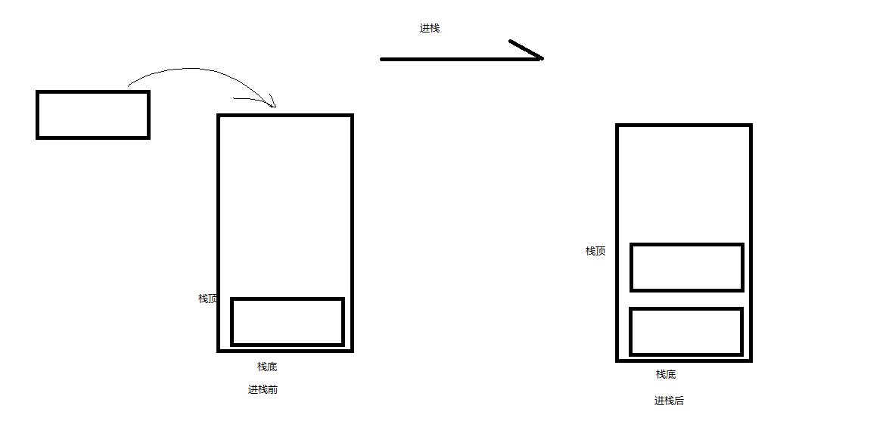
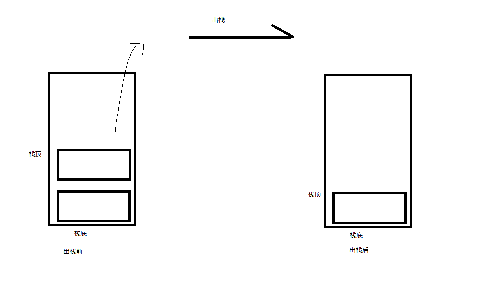
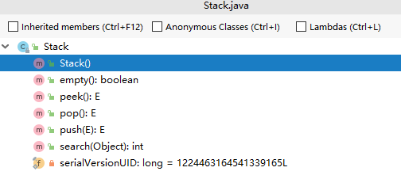
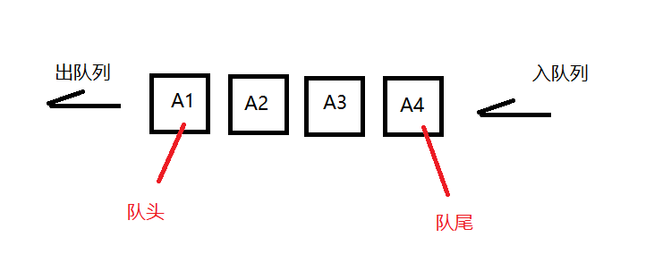
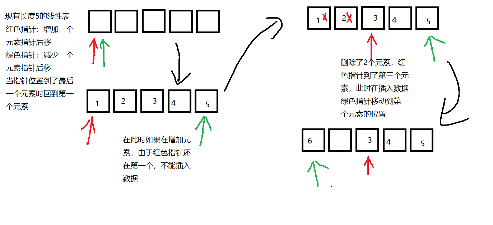
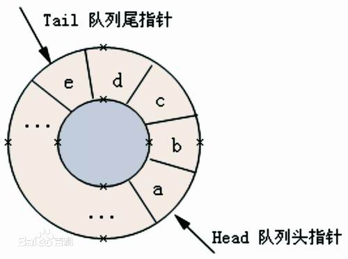
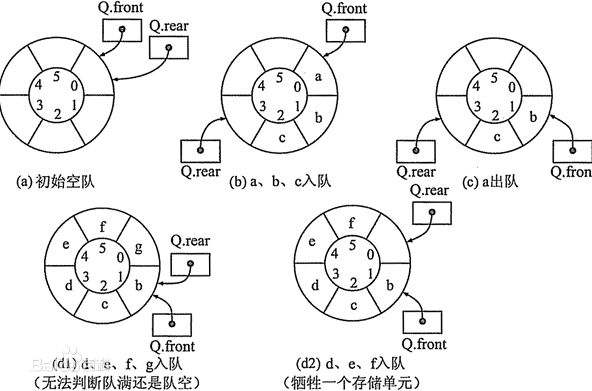
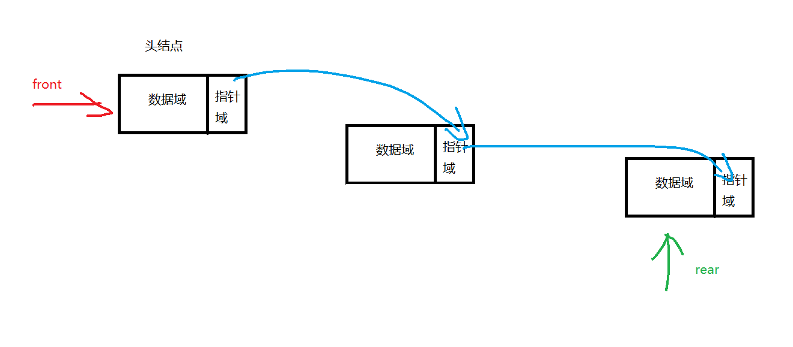
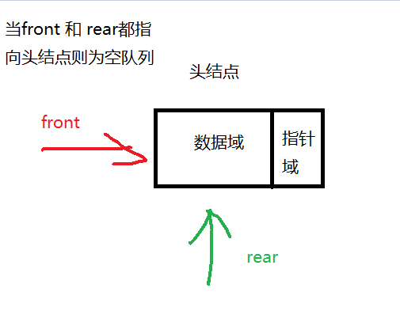

# 栈

## 定义

- 栈是限定仅在表尾进行插入和删除操作的线性表

- 允许插入和删除的一端称为栈顶，另一端称为栈底，没有元素的栈称为空栈。
- 栈是后进先出的线性表LIFO结构（Last In First Out）。

- 栈的插入操作叫做进栈、压栈、入栈。

  - 

    

- 栈的删除操作叫做出栈、弹栈。

  - 

## 栈的抽象数据类型

```tex
ADT 栈（stack)
Data
	同线性表，元素具有相同的类型，相邻元素具有前驱和后继的关系
Operation
	InitStack(*S):    初始化操作，建立一个空栈S
	DestoryStack(*S):    销毁栈
	ClearStack(*S):    将栈清空
	StackEmpty(*S):    若栈为空，返回true，否则返回false
	GetTop(S,*e):    用e接收栈顶的元素
	Push(*S,e):    将e插入到栈S并成为栈顶元素
	Pop(*S,*e):    删除栈S中的栈顶元素，用e接收
	StackLength(S):    返回栈S的元素个数
	
endADT
	
```

## java stack


- Stack 继承Vector

- push方法

  - java.util.Vector#addElement 这个方法是push的本质

    ```java
    public synchronized void addElement(E obj) {
        modCount++;
        ensureCapacityHelper(elementCount + 1);
        elementData[elementCount++] = obj;
    }
    ```

    ensureCapacityHelper() 进行扩容操作

    elementData[elementCount++] = obj;进行赋值操作

- pop方法

  - java.util.Vector#removeElementAt方法根据具体索引删除

    找到索引位置左侧右侧 删除索引位置后将左侧右侧拼起来

    ```java
    public synchronized void removeElementAt(int index) {
        modCount++;
        if (index >= elementCount) {
            throw new ArrayIndexOutOfBoundsException(index + " >= " +
                                                     elementCount);
        }
        else if (index < 0) {
            throw new ArrayIndexOutOfBoundsException(index);
        }
        int j = elementCount - index - 1;
        if (j > 0) {
            System.arraycopy(elementData, index + 1, elementData, index, j);
        }
        elementCount--;
        elementData[elementCount] = null; /* to let gc do its work */
    }
    ```




## java实现

```java
public class StackList<E> {


    /**
     * 数据存储数组
     */
    private Object[] elements = null;
    /**
     * 栈容量
     */
    private int maxSize = 0;
    /**
     * 当前栈顶指针位置
     */
    private int top = -1;


    public StackList() {
        this(10);
    }

    public StackList(int size) {
        if (size >= 0) {
            this.maxSize = size;
            elements = new Object[size];
            top = -1;
        } else {
            throw new RuntimeException("初始化长度需要大于等于0");
        }
    }

    public static void main(String[] args) {
        StackList<Integer> stackList = new StackList<>();
        stackList.push(1);
        stackList.push(2);
        stackList.push(3);
        stackList.print();
        Integer pop = stackList.pop();
        stackList.print();
    }

    public void print() {
        for (int i = 0; i < elements.length; i++) {
            if (elements[i] != null) {

            System.out.print(elements[i] + "\t");
            }

        }
        System.out.println();
    }

    /**
     * 入栈
     */
    public boolean push(E e) {
        if (top == maxSize - 1) {
            throw new RuntimeException("满了");
        } else {
            elements[++top] = e;
            return true;
        }
    }

    /**
     * 查看栈顶元素
     */
    public E peek() {
        if (top == -1) {
            throw new RuntimeException("栈为空");
        } else {
            return (E) elements[top];
        }
    }

    /**
     * 弹栈
     */
    public E pop() {
        if (top == -1) {
            throw new RuntimeException("栈为空");
        } else {
            return (E) elements[top--];
        }
    }

    /**
     * 查询索引
     */
    public int search(E e) {
        int i = top;
        while (top != -1) {
            if (peek() != e) {
                top--;
            } else {
                break;
            }
        }
        int res = top + 1;
        top = i;
        return res;
    }

    public boolean empty() {
        return top == -1;
    }
}
```


## 栈的链式存储结构

```java
public class StackLinkedList<E> {


    /**
     * 栈顶元素
     */
    private Node<E> top;
    /**
     * 栈大小
     */
    private int size;

    /**
     * 初始化
     */
    public StackLinkedList() {
        top = null;
    }

    /**
     * 当前的栈大小
     */
    public int length() {
        return size;
    }

    /**
     * 判空
     */
    public boolean empty() {
        return size == 0;
    }


    /**
     * 入栈
     */
    public boolean push(E e) {
        top = new Node<>(e, top);
        size++;
        return true;
    }

    /**
     * 查看栈顶
     */
    public Node<E> peek() {
        if (empty()) {
            throw new RuntimeException("空栈");
        } else {
            return top;
        }
    }

    /**
     * 出栈
     */
    public Node<E> pop() {
        if (empty()) {
            throw new RuntimeException("空栈");
        } else {
            // 栈顶临时变量
            Node<E> topNode = top;
            // 栈顶指向下一个元素
            top = top.next;
            // 栈顶清空
            topNode.next = null;
            size--;
            return topNode;

        }
    }


    /**
     * 栈的链式存储结点类
     */
    private class Node<E> {

        E e;
        Node<E> next;

        public Node() {
        }

        public Node(E e, Node<E> next) {
            this.e = e;
            this.next = next;
        }
    }

    public static void main(String[] args) {
        StackList<String> stringStackList = new StackList<>();
        stringStackList.push("01");
        stringStackList.push("02");
        String peek = stringStackList.peek();
        System.out.println(peek);
        String pop = stringStackList.pop();
        System.out.println();
    }
}
```


## 栈的应用

### 递归定义

- 直接调用自己或者通过一系列调用语句间接调用自己的函数叫做递归函数。
- 每个递归定义至少由一个条件，当满足条件时不再进行。


### 斐波那契数列

- 前两项的和作为后一个数
  - 1，1，2，3，5.....
- 数学函数定义

$$
f(n)=\begin{cases}
0,\quad n=0\\
1, \quad n=1\\
f(n-1)+f(n-2), \quad n>1\\

\end{cases}
$$

```java
/**
 * 迭代的方式计算fib
 */
private static void fib_1() {
    int[] fib = new int[40];
    fib[0] = 1;
    fib[1] = 1;

    for (int i = 2; i < 40; i++) {
        fib[i] = fib[i - 1] + fib[i - 2];
    }
}


   /**
     * 递归的方式计算fib
     * @param i
     * @return
     */
    private static int fib(int i) {
        if (i < 2) {
            return i == 0 ? 0 : 1;
        }
        return fib(i - 1) + fib(1 - 2);
    }

```

### 数学运算（逆波兰）

#### 后缀表达式

> 指的是不包含括号，运算符放在两个运算对象的后面，所有的计算按运算符出现的顺序，严格从左向右进行（不再考虑运算符的优先规则）

```java
public class P1175 {

    public static float evaluate(String expression) {
        char[] tokens = expression.toCharArray();

        Stack<Float> number = new Stack<>();

        Stack<Character> ops = new Stack<>();

        for (int i = 0; i < tokens.length; i++) {

            if (tokens[i] == ' ') {
                continue;
            }

            if (tokens[i] >= '0' && tokens[i] <= '9') {
                StringBuffer sbuf = new StringBuffer();
                // 拼接完整的数字两位数以上
                while (i < tokens.length && tokens[i] >= '0' && tokens[i] <= '9') {
                    sbuf.append(tokens[i++]);
                }
                i--;
                number.push(Float.parseFloat(sbuf.toString()));
            } else if (tokens[i] == '(') {
                ops.push(tokens[i]);
            } else if (tokens[i] == ')') {
                while (ops.peek() != '(') {
                    number.push(caculate(ops.pop(), number.pop(), number.pop()));
                }
                ops.pop();
            } else if (tokens[i] == '+' || tokens[i] == '-' || tokens[i] == '*'
                    || tokens[i] == '/') {

                while (!ops.empty() && hasPrecedence(tokens[i], ops.peek())) {
                    number.push(caculate(ops.pop(), number.pop(), number.pop()));
                }

                ops.push(tokens[i]);
            }
        }

        while (!ops.empty()) {
            number.push(caculate(ops.pop(), number.pop(), number.pop()));
        }

        return number.pop();
    }

    /**
     * 运算优先级
     *
     * @param op1 运算符1
     * @param op2 运算符2
     */
    public static boolean hasPrecedence(char op1, char op2) {
        if (op2 == '(' || op2 == ')') {
            return false;
        }
        return (op1 != '*' && op1 != '/') || (op2 != '+' && op2 != '-');
    }

    /**
     * 进行数学运算
     *
     * @param op 运算符
     * @param b 数b
     * @param a 数a
     * @return 结果值
     */
    public static float caculate(char op, float b, float a) {
        switch (op) {
            case '+':
                return a + b;
            case '-':
                return a - b;
            case '*':
                return a * b;
            case '/':
                if (b == 0) {
                    throw new UnsupportedOperationException("Cannot divide by zero");
                }
                return a / b;
            default:
                break;
        }
        return 0;
    }

    public static void main(String[] args) {
        System.out.println(P1175.evaluate("1+(3-1)*4/2"));
        System.out.println(P1175.evaluate("100 * 2 + 12"));
        System.out.println(P1175.evaluate("100 * ( 2 + 12 )"));
        System.out.println(P1175.evaluate("100 * ( 2 + 12 ) / 14"));
    }

}
```

# 队列

## 定义

- 只允许在一端进行插入操作，在另一端进行删除操作的线性表

- 队列时一种先进先出(First In First Out) 的线性表
- 允许插入的以端称为队尾，允许删除的以端称为队头




## 队列的抽象数据类型

```
ADT 队列(Queue)
Data
	同线性表。元素具有相同的类型,相邻元素具有前驱和后继元素
Operation
	InitQueue(*Q)：    初始化操作，建立一个空队列Q
	DestroyQueue(*Q):    若队列Q存在则销毁
	ClearQueue(*Q):    清空队列Q
	QueueEmpty(Q):    若队列Q为空，返回true，否则返回false
	GetHead(Q,*e):    若队列Q存在且非空，用e接收队列Q的队头元素
	EnQueue(*Q,e):    若队列Q存在，插入新元素e到队列Q中成为队尾元素
	DeQueue(*Q,e):    删除队列Q中队头元素，并用e接收
	QueueLength(Q):    返回队列Q的元素数量
    
endADT
```


## 循环队列



### 定义

- 头尾相接的顺序储存结构称为队列
- 队列满的条件为（**插入指针**(图中绿色)+1）%队列大小 == 删除指针(图中红色)
- （ 插入指针-删除指针+队列大小 ）% 队列大小


> 
>
> 


```java
public class RoundRobinQueue {

    private Object[] queue;
    private int queueSize;
    // 头指针
    private int front;
    // 尾指针
    private int rear;


    public RoundRobinQueue(int queueSize) {
        this.queueSize = queueSize;
        this.front = 0;
        this.rear = 0;
        this.queue = new Object[queueSize];
    }

    public static void main(String[] args) {
        RoundRobinQueue r = new RoundRobinQueue(3);
        r.enqueue("元素1");
        r.enqueue("元素2");
        // 队列满
        r.enqueue("元素3");
        Object dequeue = r.dequeue();
        System.out.println(dequeue.equals("元素1"));
    }


    /**
     * 是否满队列
     */
    public boolean isFull() {
        return (rear + 1) % queue.length == front;
    }

    public boolean enqueue(Object obj) {
        if (isFull()) {
            return false;
        }
        queue[rear] = obj;
        rear = (rear + 1) % queue.length;
        return true;
    }


    public Object dequeue(){
        if(rear==front){
            return null;
        }
        Object obj = queue[front];
        front = (front+1)%queue.length;
        return obj;
    }


}
```

## 队列的链式存储

- 队头front指向链表的头结点，队尾rear指向终端结点





java实现

```java
public class LinkedQueue<E> {

    /**
     * 头指针
     */
    private Node<E> first;
    /**
     * 尾指针
     */
    private Node<E> last;
    private int qSize;

    public LinkedQueue() {
        this.first = null;
        this.last = null;
        this.qSize = 0;

    }

    public static void main(String[] args) {
        LinkedQueue<String> l = new LinkedQueue<>();
        l.add("元素1");
        l.add("元素2");
        l.add("元素3");
        l.add("元素4");
        String delete = l.delete();
         delete = l.delete();
         delete = l.delete();
         delete = l.delete();
        System.out.println();
    }

    /**
     * 判空
     */
    public boolean isEmpty() {
        return first == null;
    }

    /**
     * 获取头
     */
    public Node peek() {
        if (isEmpty()) {
            throw new RuntimeException();
        }
        return first;
    }

    /**
     * 删除元素 头部删除
     */
    public E delete() {
        if (isEmpty()) {
            throw new RuntimeException();
        }
        E data = first.data;
        first = first.next;

        if (isEmpty()) {
            last = null;
        }

        qSize--;
        return data;
    }


    /**
     * 添加元素 尾部追加
     */
    public void add(E data) {
        Node old = last;
        last = new Node<>();
        last.data = data;
        last.next = null;
        if (isEmpty()) {
            first = last;
        } else {
            old.next = last;
        }
        qSize++;
    }

    private class Node<E> {

        Node<E> next;
        E data;

    }


}
```

