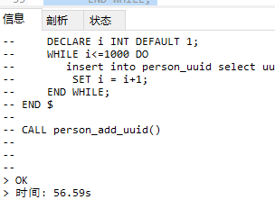
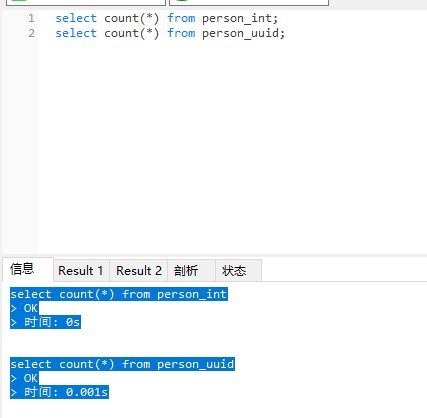

# mysql 主键INT 与 varchar 比较

- 创建两个表格，一张 用int 一张用 varchar

```sql
create table person_int(id int primary key auto_increment,name varchar(10),sex char(1));
create table person_uuid(id varchar(36) primary key ,name varchar(10),sex char(1));
```


- 两张表分别插入1000 条数据

  ```sql
  DROP PROCEDURE IF EXISTS person_add_int;
  DELIMITER $
  CREATE PROCEDURE person_add_int()
  BEGIN
      DECLARE i INT DEFAULT 1;
      WHILE i<=1000 DO
          insert into person_int  (name,sex) select '张三','1' ;
          SET i = i+1;
      END WHILE;
  END $
  
  CALL person_add_int()
  
  ```

  

  耗时 56.59s

   ```sql
  DROP PROCEDURE IF EXISTS person_add_uuid;
  DELIMITER $
  CREATE PROCEDURE person_add_uuid()
  BEGIN
      DECLARE i INT DEFAULT 1;
      WHILE i<=1000 DO
         insert into person_uuid select uuid(),'张三','1' ;
          SET i = i+1;
      END WHILE;
  END $
  
  CALL person_add_uuid()
  
   ```

  

  耗时62.207s


相同数据的1000条记录数据容量使用情况


- 添加索引 索引类型 `unique` 索引方法`btree`

  - int类型

    

  - varchar类型

    


进行select count() 查询

